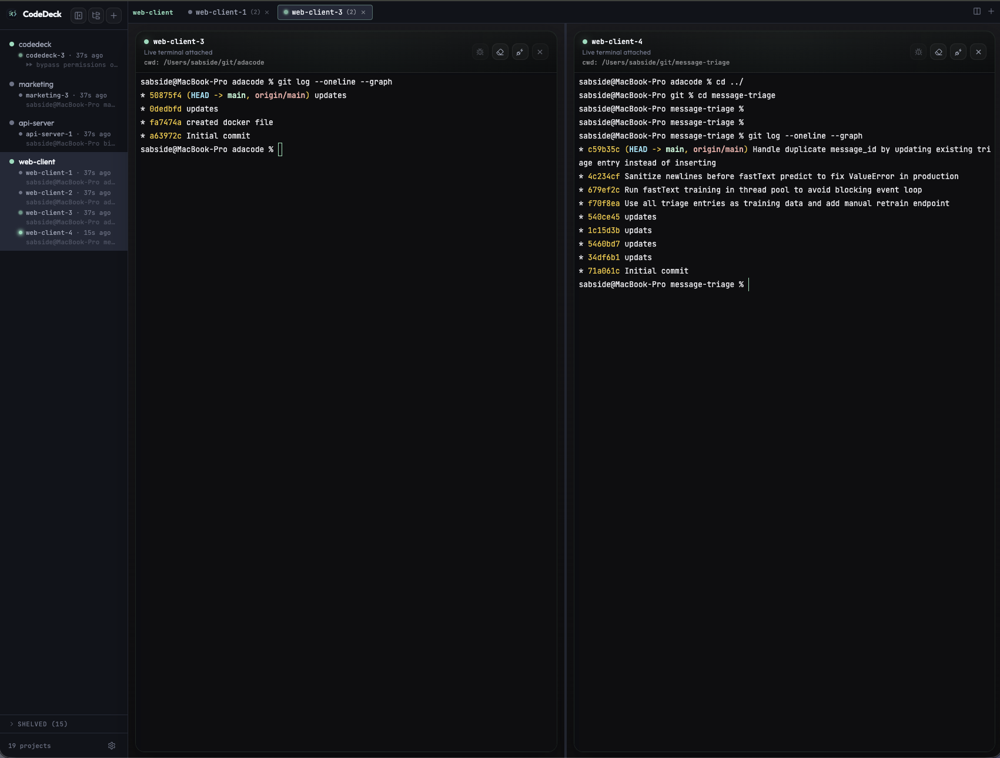

# CodeDeck

A browser-based terminal workspace for developers who juggle multiple projects. Split panes, project switching, file browsing — no IDE overhead.



## Features

- **Multi-project workspace** — organize terminals by project, switch between them instantly
- **Unlimited split panes** — side-by-side terminals with draggable dividers per tab
- **Live sidebar cockpit** — per-project status (active/idle/dead), terminal count, elapsed time
- **Per-project file browsing** — browse any project's files and open them in your editor
- **Terminal resilience** — debug inspector, replay buffer, visibility-aware recovery, heartbeat monitoring
- **Durable sessions** — tmux-backed by default; terminals survive browser detaches and server restarts
- **Toast notifications** — success/error feedback on every action, no silent failures

## Setup

Prerequisites: Node.js 22+, npm 10+. Optional: tmux (for durable terminal sessions).

```bash
# Install dependencies
npm install

# Start both servers (backend :43001, frontend :43000)
./server.sh start

# Manage the service
./server.sh stop     # Stop gracefully
./server.sh restart  # Restart
./server.sh status   # Check status
./server.sh logs     # Show recent logs
```

Open `http://localhost:43000` in your browser.

## Usage

1. Click **+** in the sidebar to add a project (give it a name and the absolute path).
2. Click a project to open a terminal scoped to that directory.
3. Use **Split right** (columns icon) to add side-by-side terminal panes — drag dividers to resize, double-click to reset.
4. Use **+** in the tab bar to open new terminal tabs. Each tab has its own set of panes.
5. The sidebar shows live status per project: terminal count, activity indicator (green = active, gray = idle, red = dead), and elapsed time.
6. Click the **folder icon** on any project row to browse its files — clicking a file opens it in your configured editor.
7. Toast notifications confirm every action and surface errors.

## Terminal Resilience

CodeDeck includes built-in resilience features for debugging and recovering misbehaving panes:

- **Debug inspector** — click the bug icon on any pane to see health status, lifecycle timeline, and diagnostics
- **Recovery actions** — Reconnect, Resync (replay without teardown), and Redraw (force repaint)
- **Visibility-aware recovery** — returning to a backgrounded tab automatically resizes, resyncs, and replays missed output
- **Replay buffer** — bounded per-session output buffer replays missed data on reconnect
- **Heartbeat & stall detection** — detects stale views (throttled, paint lag) and surfaces the reason

### Terminal Runtime

CodeDeck defaults to `tmux`-backed sessions. If `tmux` is not installed, it falls back to raw PTY mode.

```bash
# Force durable tmux-backed sessions
CODEDECK_TERMINAL_RUNTIME=tmux ./server.sh start

# Force raw PTY sessions
CODEDECK_TERMINAL_RUNTIME=pty ./server.sh start
```

### Prevent macOS Sleep

Set `CODEDECK_CAFFEINATE=1` to wrap the server under `caffeinate -i`, preventing idle sleep.

## Config

Projects and settings are stored in SQLite at `~/.codedeck.db`:

- `defaultPath` — starting directory for the project picker
- `editorCommand` — command for opening files (defaults to `code -r`)

## Architecture

```
Browser (React + xterm.js)
  ↕ WebSocket (terminal I/O)
  ↕ REST (projects, files, sessions, health)
Node.js server (Express + node-pty)
  ↕ PTY pool (one per terminal pane)
  ↕ SQLite (project config)
  ↕ fs (file tree reads)
  ↕ child_process (open files in editor)
```

See [docs/steering/](docs/steering/) for detailed architecture, tech stack, and project structure.

## Contributing

See [CONTRIBUTING.md](CONTRIBUTING.md) for development setup and guidelines.

## License

[MIT](LICENSE)
