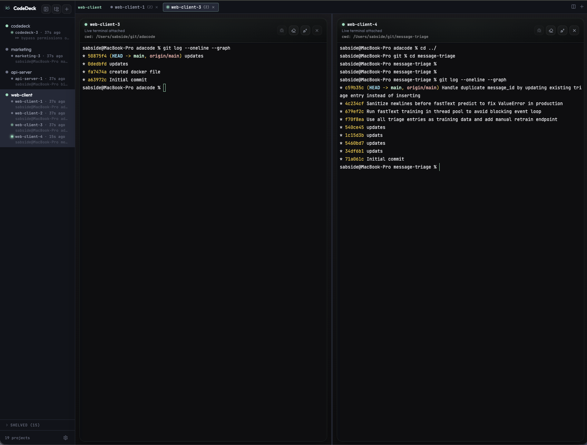

<p align="center">
  
</p>

# CodeDeck

A browser-based terminal workspace for developers who juggle multiple projects. Split panes, project switching, file browsing — no IDE overhead. Especially useful for CLI-based agentic coding workflows where each project needs 3-4 terminals running simultaneously.



## Features

- **Multi-project workspace** — organize terminals by project, switch between them instantly
- **Unlimited split panes** — side-by-side terminals with draggable dividers per tab
- **Live sidebar cockpit** — per-project status (active/idle/dead), terminal count, elapsed time
- **Waiting tabs** — park a tab you have handed to an agent: it shrinks, dims and groups left, then clears itself the moment the work lands
- **Per-project file browsing** — browse any project's files and open them in your editor
- **Truthful terminal scrollback** — VS Code-style scrolling, snapshot-first reconnects, and visible warnings when preserved history cannot be guaranteed
- **Terminal resilience** — debug inspector, transport replay catch-up, visibility-aware recovery, heartbeat monitoring
- **Durable sessions** — tmux-backed sessions survive browser detaches and server restarts
- **Terminal workflows** — repeat a command in your running agent, clearing context between passes until the agent reports completion
- **Descriptive session titles** — optional background naming through configurable local CLIs, with manual rename and retry
- **Toast notifications** — success/error feedback on every action, no silent failures

## Setup

Prerequisites: Node.js 22+, npm 10+, and `tmux` (required for terminal sessions).

```bash
# Install dependencies
npm install

# Start both servers (backend :43001, frontend :43000)
./server.sh start

# Manage the service
./server.sh stop     # Stop gracefully
./server.sh restart  # Restart
./server.sh status   # Check status
./server.sh logs     # Show recent logs
```

Open `http://localhost:43000` in your browser.

## Usage

1. Click **+** in the sidebar to add a project (give it a name and the absolute path).
2. Click a project to open a terminal scoped to that directory.
3. Use **Split right** (columns icon) to add side-by-side terminal panes — drag dividers to resize, double-click to reset.
4. Use **+** in the tab bar to open new terminal tabs. Each tab has its own set of panes.
5. The sidebar shows live status per project: terminal count, activity indicator (green = active, gray = idle, red = dead), and elapsed time.

Agent status comes from the live prompt, status, and footer region of each CLI pane, with 20 seconds of silence vetoing a stale working marker. Input dialogs appear as **Needs input**; working sub-agent panes and background shells keep the session **Running**. An idle agent with a live background shell therefore shows as Running.
6. Use the pane **eye icon** — or **Cmd/Ctrl+Shift+M** on the active pane — to mute/show status colors without changing the terminal's real running/idle/finished state.
7. Click the **hourglass** on a tab — beside its close button — or press **Cmd/Ctrl+Shift+U** on the active tab, to mark it waiting when you have handed its work to an agent. Waiting tabs shrink, dim and group to the left of the tab bar, their status indicators stop pulsing everywhere (tab, pane header, and sidebar), and the sidebar shows a count per project. The mark clears itself as soon as the work finishes or the session dies, so the finished styling and completion notification still reach you. Phone pushes are held while the desktop UI has been used in the last two minutes.
8. Click the **folder icon** on any project row to browse its files — clicking a file opens it in your configured editor.
9. Toast notifications confirm every action and surface errors.

## Copying terminal text

On macOS, hold **Option/Alt** and drag over the text, then press **Cmd+C**.
The display pauses while you select; the agent keeps running and output is held
until you press **Esc**, type, or click once to resume. That first click only
resumes the display; subsequent clicks reach the terminal application normally.
The highlight stays after copying. Selection alone does not copy, and terminal
OSC 52 sequences cannot read or overwrite the clipboard. Clipboard failures
appear as a toast. Resizing or reconnecting ends selection with a notice.

## Terminal workflows

Start your agent in a terminal and finish any setup or permission dialogs. At an empty
prompt, open **Workflow**, enter your command (for example, `/feature-dev docs/todos/my-feature.md`),
check the reset command (defaults to `/clear`), and click **Start**.

CodeDeck submits the command with instructions for the agent to report **CONTINUE**,
**COMPLETE**, or **NEEDS_INPUT** using a unique signal. CONTINUE clears context and
submits another pass; COMPLETE ends the loop.
NEEDS_INPUT pauses it: answer the agent in the terminal and the workflow returns to
**Running**, then carries on when the agent signals CONTINUE or COMPLETE. Keep progress in a file
that the command reads each pass. Commands and reset behavior must suit your agent.

Typing and file uploads are locked during the loop. **Stop** releases the terminal
without interrupting the agent's current work. If the agent opens a dialog or omits
the signal, stop the workflow, handle it manually, and start again at an empty prompt.
Silence is never treated as completion. Reset submission waits for terminal output
to settle; this does not prove that an agent accepted the reset.

Workflows keep running when you switch projects, refresh, or disconnect the browser.
Reconnecting restores the current workflow status without submitting another command.
The backend keeps a terminal attachment open until the loop ends. **Stop**, closing
the terminal, or losing the terminal connection ends repetition. Restarting the CodeDeck
server also stops workflows: their state is held in backend memory, not on disk.

## Session naming

Open **Settings → Session naming** and select a provider, an exact case-sensitive
model ID, and optional reasoning effort. Claude Code and Codex are initial editable
profiles, not a fixed provider list. **Add provider** lets you capture another CLI;
**Remove provider** removes its profile. Changes take effect only after saving.
Existing Claude/Codex selections remain valid. Legacy Conduit settings are retained
but require a CLI selection; existing titles are preserved.

Each profile has an executable name or absolute path, a JSON array of arguments,
optional effort arguments, a prompt input method, and a response format. Use
`{model}` in the arguments; use `{prompt}` exactly once for argument input, or
choose standard input and omit `{prompt}`. Effort arguments use `{effort}` and are
omitted when effort is blank. Use `[]` when the CLI does not support effort.
Arguments are passed directly without a shell. Configure the CLI for non-interactive
use and disable tools; authenticate through the CLI, not secrets in the saved arguments.

For example, a **Cursor** profile can use executable `agent`, argument input, no
effort arguments, the **JSON result envelope** response format, and:

```json
["--print", "--trust", "--mode", "ask", "--output-format", "json", "--model", "{model}", "{prompt}"]
```

A **Kiro** profile can use executable `kiro-cli`, argument input,
`["--effort", "{effort}"]` for effort arguments, **Title JSON on stdout**, and:

```json
["chat", "--no-interactive", "--model", "{model}", "{prompt}"]
```

See [Kiro's CLI reference](https://kiro.dev/docs/cli/reference/cli-commands/)
for flags supported by your installed version. Kiro was not installed for live
verification of this example. The command must emit the requested title JSON without
banners; CLIs with another output shape need a wrapper that emits title JSON.

Response formats are explicit: **Title JSON on stdout** expects
`{"title":"Short title"}` (or `{"title":null}`); **JSON result envelope** expects
a successful `type: "result"`, `is_error: false` envelope whose `result` is that JSON
string; **Codex JSON event stream** reads a single completed agent message. Invalid
responses fail naming without substituting another provider or changing the title.

After a submitted task starts running, CodeDeck sends a bounded terminal excerpt to
the selected local CLI for a short title. This works through the shared local/remote terminal activity
interface. Naming runs independently of terminal input, output, and navigation. Empty Enter presses do not arm naming. Startup
banners alone can return insufficient context and wait for another submission.

Use the pencil beside a pane's name to rename it. Manual titles take precedence over
pending generation. Failed naming retains the current label, shows the reason, and retries automatically every
10 seconds for up to one minute after the first failure. Each retry captures fresh terminal
context. After that window, **Retry naming** or a new task submission starts a fresh attempt.
Titles persist across reloads; a split tab uses its first pane's title. Hover a label to
see the original session ID. Existing sessions are eligible on their next submitted task;
there is no retrospective bulk naming.

CodeDeck bounds naming excerpts to 12,000 characters and does not persist them.
The configured CLI and its provider have their own retention policies. Naming runs
from a temporary directory, with a 65-second process timeout and a 1 MiB output limit.
The CLI runs on the CodeDeck server, including when the terminal itself is remote.

## Terminal Resilience

CodeDeck includes built-in resilience features for debugging and recovering misbehaving panes:

- **Debug inspector** — click the bug icon on any pane to see health status, lifecycle timeline, and diagnostics
- **Recovery actions** — Reconnect, Resync (transport catch-up without teardown), and Redraw (force repaint)
- **Truthful reconnects** — every attach/reconnect clears stale browser history and reseeds from a fresh tmux snapshot of the recent 10,000-line window
- **Visibility-aware recovery** — returning to a backgrounded tab automatically resizes, resyncs, and catches up missed live output
- **Replay buffer** — bounded per-session output buffer is transport-only catch-up, not the preserved-history authority
- **Heartbeat & stall detection** — detects stale views (throttled, paint lag) and surfaces the reason

### Terminal Runtime

CodeDeck requires `tmux` for all terminal sessions. If `tmux` is missing, the UI blocks terminal creation and prompts you to install it instead of silently downgrading durability.

```bash
# Supported terminal runtime contract
CODEDECK_TERMINAL_RUNTIME=tmux ./server.sh start
```

Legacy non-`tmux` runtime values are ignored; the backend still enforces tmux-required terminals.

### Prevent macOS Sleep

Set `CODEDECK_CAFFEINATE=1` to wrap the server under `caffeinate -i`, preventing idle sleep.

## Config

Projects and settings are stored in SQLite at `~/.codedeck.db`:

- `defaultPath` — starting directory for the project picker
- `editorCommand` — command for opening files (defaults to `code -r`)

## Architecture

```
Browser (React + xterm.js)
  ↕ WebSocket (terminal I/O)
  ↕ REST (projects, files, sessions, health)
Node.js server (Express + node-pty)
  ↕ PTY pool (one per terminal pane)
  ↕ SQLite (project config)
  ↕ fs (file tree reads)
  ↕ child_process (open files in editor)
```

See [docs/steering/](docs/steering/) for detailed architecture, tech stack, and project structure.

## Contributing

See [CONTRIBUTING.md](CONTRIBUTING.md) for development setup and guidelines.

## License

[MIT](LICENSE)
