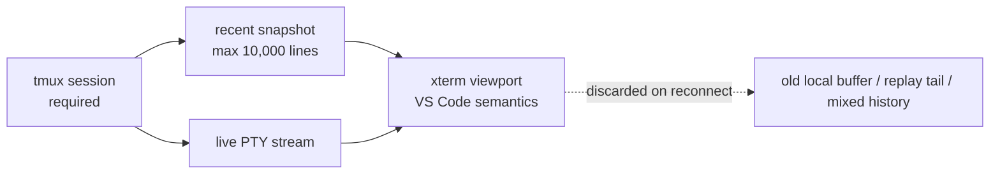

# Truthful Terminal Scrollback Design

**Date:** 2026-04-21
**Scope:** Re-center CodeDeck terminals on VS Code-style scrolling with tmux-backed durability and a single authoritative reconnect seed.

## Architecture

### Problem being solved

CodeDeck currently mixes several mechanisms into the visible terminal history model:

- tmux durability and scrollback
- xterm local viewport state
- replay-buffer reconnect recovery
- special-case history hydration and wheel routing

That hybrid model improved resilience, but it also created the most dangerous failure class: the visible terminal can drift from the real session.

The design goal of this feature is not a new fancy UX. It is to make the terminal **trustworthy** while preserving the durability wins already achieved.

### Target architecture

### Design principles

1. **One authoritative reconnect seed**
   - Any attach/reattach starts from a fresh tmux snapshot.
   - The browser throws away stale local history first.

2. **VS Code semantics in the viewport**
   - The user scrolls xterm like a normal terminal emulator.
   - tmux copy-mode does not become the ordinary scroll UX.

3. **tmux required, not optional**
   - Durability depends on tmux.
   - Missing tmux is a visible setup problem, not a silent downgrade.

4. **Truthfulness over clever recovery**
   - If recent history cannot be guaranteed, say so.
   - Never present best-effort recovered history as complete.

## Entities

No database entities or schema changes are expected.

The relevant runtime entities are:

| Runtime object | Responsibility |
| --- | --- |
| tmux session | durable terminal lifetime across browser/backend churn |
| recent snapshot | authoritative reconnect seed for the last 10,000 lines |
| xterm viewport | VS Code-like user-facing scrollback and rendering |
| guarantee state | whether the preserved recent history can be trusted after reconnect |

## New Enums / States

### History guarantee state

| State | Meaning |
| --- | --- |
| `guaranteed` | preserved recent history was reconstructed from authoritative tmux snapshot |
| `unavailable` | recent history could not be reconstructed accurately; live output may still be attached |

### Runtime availability state

| State | Meaning |
| --- | --- |
| `ready` | tmux available; terminals may be created/attached |
| `missing_tmux` | tmux unavailable; UI must ask user to install tmux |

## DTOs / Protocol Shapes

### `session`
- `sessionId`
- `existing`
- `runtimeType`
- `snapshotWindowLines`
- `historyGuaranteed`

### `snapshot`
- `sessionId`
- `windowLines`
- `lineCount`
- `historyGuaranteed`
- `data`

### `history_warning`
- `sessionId`
- `reason`
- `message`

### Health/session extensions
- tmux availability
- history guarantee state
- warning reason if degraded

## Endpoints / Surfaces

| Surface | Purpose |
| --- | --- |
| `GET /api/health` | report tmux availability and terminal runtime contract |
| `GET /api/sessions` | report session summary plus guarantee metadata |
| `GET /api/debug/terminal-health` | report rich diagnostics for degraded reconnects |
| `/ws/terminal` | attach, snapshot hydrate, then stream live output |

## Service Logic

### Terminal runtime
- enforce tmux-only mode
- expose tmux availability explicitly
- capture recent snapshot window
- rediscover durable sessions after backend restart

### WebSocket/session orchestration
- on attach: resolve session → capture snapshot → send snapshot → begin live stream
- avoid stitching visible history from stale browser state and replay fragments
- mark history as unavailable when snapshot truth cannot be guaranteed

### Frontend terminal orchestration
- clear stale xterm state before writing a reconnect snapshot
- preserve VS Code-like auto-follow / detach / Latest behavior
- stop routing ordinary scroll behavior into tmux history semantics
- render explicit warning when preserved history is unavailable

## Implementation Files (future work for `/feature-dev`)

### Backend
- `server/terminal-runtime.js`
- `server/ws-handler.js`
- `server/index.js`
- `server/terminal-session-status-service.js`
- `server/__tests__/terminal-runtime.test.js`
- `server/__tests__/ws-handler.test.js`
- additional server tests as needed for health/session surfaces

### Frontend
- `client/src/components/Terminal.jsx`
- `client/src/components/TerminalInspector.jsx`
- `client/src/components/TerminalArea.jsx` (only if session metadata plumbing needs adjustment)
- `client/src/utils/terminalAutoScroll.js`
- `client/src/utils/terminalResume.js`
- `client/src/components/__tests__/TerminalAutoScroll.test.jsx`
- `client/src/components/__tests__/TerminalHistoryRestore.test.jsx`
- `client/src/components/__tests__/hard-refresh-race.test.jsx`
- additional client tests for warning states and snapshot-first reconnects

## Key decisions

### Keep VS Code UX, do not go tmux-copy-mode-first
The product target remains “feel like VS Code,” not “feel like raw tmux.” The fix is not to expose tmux copy-mode; it is to stop mixing tmux-history semantics into a VS Code-style viewport.

### Reconnect always reseeds from tmux snapshot
The user does not care about exact scroll-position restoration after refresh. That makes the reconnect contract much simpler: reseed from the authoritative recent window, land at latest, continue live.

### Fixed 10,000-line window
A product-owned fixed window avoids settings complexity and keeps the guarantee legible.

### Visible truthfulness failures
The worst failure is a believable lie. Explicit degraded-mode warnings are therefore part of the design, not an optional polish item.
