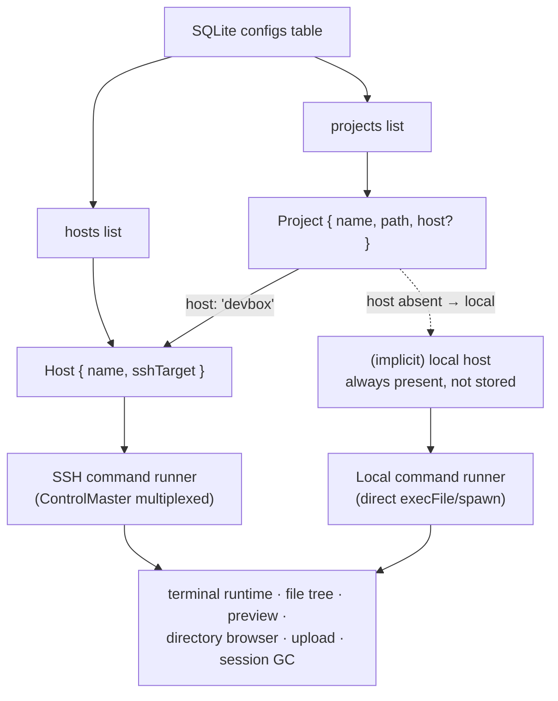
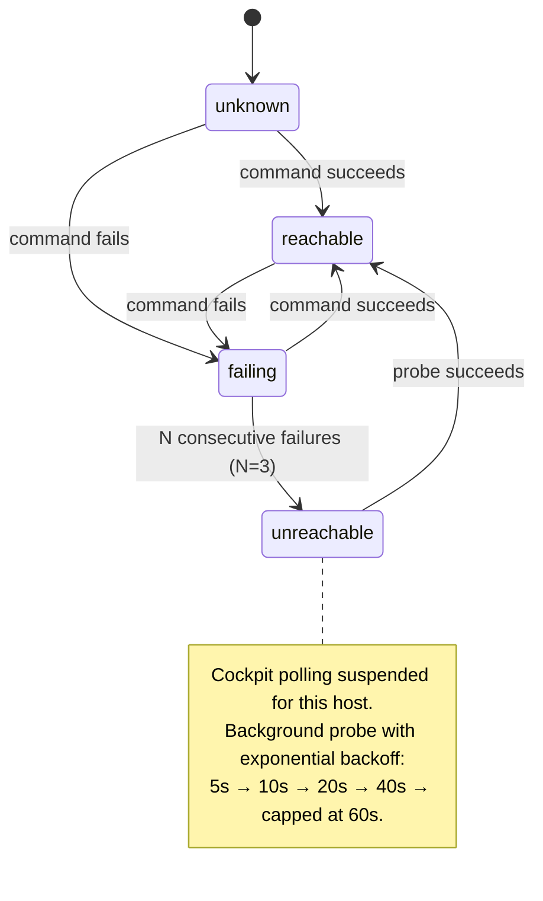
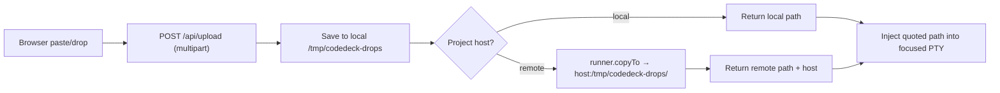

# Remote Host Connectors — Feature Specification

**Version:** 1.0
**Date:** 2026-07-06
**Status:** Draft

## 1. Overview

CodeDeck currently assumes every project lives on the local machine: terminals spawn local tmux sessions, the file tree reads the local filesystem, and uploads land in local `/tmp/codedeck-drops`. This feature makes **hosts first-class**: the user defines remote hosts (reachable via plain SSH keys through `~/.ssh/config`), ties each project to exactly one host, and every capability — durable tmux terminals, snapshot-first reconnects, cockpit status, file tree, file preview, directory browsing, screenshot/file paste, open-in-editor — works identically whether the project is local or remote.

The durability story *improves* for remote projects: tmux runs on the remote host, so sessions survive not just browser reloads and CodeDeck server restarts but also laptop sleep, WiFi drops, and SSH disconnects. The existing "truthful reconnect" contract (fresh snapshot reseed on every attach) maps directly onto network failure recovery.

**Auth predicate:** SSH key authentication must already work non-interactively (`ssh <target> true` succeeds without prompts). CodeDeck stores no credentials, no ports, no key paths — all connection detail lives in `~/.ssh/config`. No jump hosts, no password auth, no interactive prompts are supported.

## 2. Domain Hierarchy



A **Host** is a named SSH destination. A **Project** references at most one host by name; absence of a `host` field (or the literal value `local`) means the built-in local host. All existing projects therefore remain valid without migration.

## 3. Entity: Host

Stored as a JSON array under the config key `hosts` in the existing `configs` key-value table (same pattern as the `projects` key). No new tables, no schema migration.

| Field | Type | Constraints | Default |
|-------|------|-------------|---------|
| `name` | string | required, non-empty, unique (case-insensitive), max 64 chars, must not be `local` (reserved) | — |
| `sshTarget` | string | required, non-empty; an `~/.ssh/config` alias or `user@hostname` form; no whitespace | — |

**Uniqueness:** `name` is unique across hosts. `sshTarget` uniqueness is NOT enforced (two named hosts may point at the same box).

**Reserved local host:** the identifier `local` always refers to the local machine. It is never stored in the `hosts` config value, cannot be created, renamed, or deleted, and always appears first in host listings returned by the API.

**Validation of `sshTarget`:** must match `^[A-Za-z0-9._@-]+$`. This is a hard requirement — the value is passed as an argument to `ssh`/`scp` and must never be able to smuggle flags or shell metacharacters. Values starting with `-` are rejected.

## 4. Entity Change: Project

The existing project object gains one optional field:

| Field | Type | Constraints | Default |
|-------|------|-------------|---------|
| `host` | string | optional; must equal `local` or the `name` of an existing host | absent (= local) |

- Existing stored projects (no `host` field) behave exactly as today.
- `path` is interpreted on the project's host filesystem. Path-existence validation at add time runs through the host's command runner.
- Project path uniqueness is scoped **per host**: the same path may exist as a project on two different hosts, but not twice on the same host.

## 5. Command Runner Contract

One abstraction underlies every capability. A runner is resolved per host and injected into all host-touching code paths (terminal runtime, file routes, upload, GC). Local is the trivial implementation. All process launching uses `execFile`-style argv arrays — never string-concatenated shell commands.

| Method | Purpose | Local implementation | SSH implementation |
|--------|---------|----------------------|--------------------|
| `run(cmd, args, opts)` | One-shot command, capture stdout/stderr, enforce timeout | `execFile(cmd, args)` | `execFile('ssh', [...batchFlags, target, quotedRemoteCommand])` |
| `spawnPty(cmd, args, {cols, rows, cwd})` | Interactive PTY-attached process | node-pty `spawn(cmd, args)` | node-pty `spawn('ssh', ['-tt', ...batchFlags, target, quotedRemoteCommand])` |
| `copyTo(localPath, remotePath, opts)` | Move a file onto the host | `fs.copyFile` | `execFile('scp', [...batchFlags, localPath, target + ':' + remotePath])` |

**SSH invocation rules (behavioral requirements, all mandatory):**

- **Non-interactive always:** every `ssh`/`scp` call includes `-o BatchMode=yes` so a broken key setup fails fast with an error instead of hanging on a password prompt.
- **ControlMaster multiplexing:** every call includes `-o ControlMaster=auto -o ControlPath=<codedeck socket dir>/%C -o ControlPersist=600`. The socket directory is a CodeDeck-owned path under the user's home (mode 0700, created on demand). First command per host pays the handshake; subsequent commands ride the multiplexed connection.
- **Timeouts on everything:** `run` default timeout 10 000 ms; status-poll calls use 5 000 ms; `-o ConnectTimeout=5` additionally bounds connection establishment. A timed-out command is killed and reported as a failure — never left blocking.
- **Argument safety:** remote command arguments pass through a single shell layer on the remote side, so each argument must be shell-quoted (single-quote wrapping with embedded-quote escaping) before joining into the remote command string. `sshTarget` is validated per §3 and always preceded by `--` where the ssh CLI supports it.
- **No synchronous SSH calls:** the SSH runner exposes only async methods. Existing synchronous local call sites that become host-aware must migrate to the async variants (async equivalents already exist for the polled paths).

## 6. API Endpoints

### 6.1 Hosts (new)

| Method | Path | Action | Status |
|--------|------|--------|--------|
| GET | `/api/hosts` | List hosts (local first, then stored hosts) with live reachability state | 200 |
| POST | `/api/hosts` | Create a host | 201 |
| PUT | `/api/hosts/:name` | Rename a host and/or change its sshTarget | 200 |
| DELETE | `/api/hosts/:name` | Delete a host (blocked while referenced) | 200 |
| POST | `/api/hosts/:name/test` | Test connection: ssh reachability + remote tmux presence | 200 |

**Error cases:**

| Status | Condition |
|--------|-----------|
| 400 | Missing/invalid `name` or `sshTarget` (incl. reserved name `local`, regex violation) |
| 404 | Unknown host name on PUT/DELETE/test |
| 409 | Duplicate host name on POST/PUT; DELETE while ≥1 project references the host |

Renaming a host via PUT updates the `host` field of all projects referencing the old name in the same operation (single source of truth stays consistent).

### 6.2 Modified existing endpoints

| Method | Path | Change |
|--------|------|--------|
| POST | `/api/projects` | Accepts optional `host`; validates host exists; path-existence check runs on that host; 503 with host-unreachable error if the host cannot be reached during validation |
| GET | `/api/projects` | Each project includes its `host` (defaulting to `local`) |
| GET | `/api/browse` | Accepts `host` query param; directory listing runs on that host |
| GET | `/api/files` (tree) | Resolves the project's host; tree read runs through its runner |
| GET | file preview endpoint | Same host resolution; content fetched via runner |
| POST | `/api/open-file` | For remote projects, launches `code --remote ssh-remote+<sshTarget> <path>` locally instead of the configured `editorCommand` |
| POST | `/api/upload` | Accepts optional `host` (or session/project reference resolving to one); after local save, copies the file to the host's `/tmp/codedeck-drops/` and returns the **remote** path |
| GET | session/status endpoints | Include per-session host and host reachability state |
| WS | `/ws/terminal` | Session attach resolves the owning project's host and uses its runner for the tmux runtime |

### 6.3 Terminal session identity

Session IDs keep the existing `${projectName}-N` format. tmux session namespaces are per host (each host has its own tmux server), so cross-host name collisions are impossible by construction. The in-memory session entry gains a `host` field so reconnect, snapshot, status, and kill always route to the correct runner. Session enumeration (`listSessionIds`) and idle-session GC iterate **every configured host** (skipping hosts currently marked unreachable, retrying on recovery).

## 7. Request/Response Schemas

**POST `/api/hosts`** request / 201 response:

```json
{ "name": "devbox", "sshTarget": "devbox" }
```

**GET `/api/hosts`** response:

```json
[
  { "name": "local", "sshTarget": null, "builtIn": true, "reachability": "reachable" },
  { "name": "devbox", "sshTarget": "devbox", "builtIn": false, "reachability": "unreachable", "lastError": "connect timeout", "unreachableSince": 1720287000000 }
]
```

**POST `/api/hosts/devbox/test`** response (always 200 — the result payload carries truth):

```json
{
  "sshOk": true,
  "sshDetail": null,
  "tmuxOk": false,
  "tmuxDetail": "tmux not found on devbox — install tmux to enable durable terminals",
  "latencyMs": 184
}
```

**POST `/api/upload`** response for a remote-targeted upload:

```json
{ "path": "/tmp/codedeck-drops/1720287000000-screenshot.png", "host": "devbox" }
```

**Error shape** (unchanged project convention): `{ "error": "human-readable message", "detail": "optional" }`. Host-unreachable failures use a distinguishable error: `{ "error": "host unreachable", "detail": "devbox: connect timeout", "host": "devbox" }` with status 503.

## 8. Behavioral Rules

### 8.1 Host reachability state machine



- A single failed command never flips a host to `unreachable` — transient blips tolerate up to 2 failures.
- While `unreachable`: no new SSH commands are issued for that host except the backoff probe (`ssh <target> -o BatchMode=yes -o ConnectTimeout=5 true`). API calls needing that host fail fast with the 503 host-unreachable error — nothing queues, nothing blocks.
- On recovery (probe succeeds): host returns to `reachable`, polling resumes, and every session on that host whose browser attachment is waiting performs the standard reconnect: fresh tmux snapshot reseed (existing truthful-reconnect contract — new trigger, same mechanism).
- Reachability state lives in server memory (not persisted); server restart resets to `unknown`.

### 8.2 Truthful status vocabulary

Three distinct failure states must never be conflated in the UI:

| State | Meaning | UI treatment |
|-------|---------|--------------|
| Backend unreachable | CodeDeck server itself down | Existing reconnect banner (unchanged) |
| Host unreachable | Backend fine; SSH to host failing | Project rows greyed with host badge in warning state + "unreachable" label; terminals show a host-unreachable overlay with retry affordance; sessions NOT marked dead |
| Session dead | Host reachable; tmux session gone | Existing red/dead treatment (unchanged) |

A session on an unreachable host is displayed as **unknown/suspended, never dead** — the remote tmux session is presumed alive. Marking it dead would be a lie.

### 8.3 Remote tmux requirement

The existing rule extends per host: tmux must be installed **on the project's host**. If a host lacks tmux, terminal creation for that host's projects is blocked with the same install-prompt UX used locally today (message names the host). Remote tmux availability is checked through the runner (`run('tmux', ['-V'])`) and cached with the same status semantics as the local check; "test connection" reports it explicitly (§7).

### 8.4 Terminal runtime over a runner

All tmux runtime operations (`new-session`, `attach-session` via PTY, `kill-session`, `has-session`, `capture-pane` snapshots, `display-message` cwd/execution-state, `resize-window`, `list-sessions`) execute through the session's host runner. Behavior is otherwise identical to today: snapshot window stays 10 000 lines, snapshot capture and normalization logic is unchanged, execution classification consumes the same tmux outputs. The interactive attach for remote sessions is `spawnPty` → `ssh -tt <target> tmux attach-session -t <name>`; PTY exit due to SSH drop is treated as a detach (recoverable while the host's tmux session exists), not a session death.

### 8.5 Upload / screenshot paste to remote



- Remote directory `/tmp/codedeck-drops/` is created on demand (`mkdir -p` via runner) before the first copy.
- Filename convention unchanged (`<timestamp>-<sanitized-name>`); the remote path uses the same name as the local temp file.
- `scp` failure (host unreachable, disk full) returns 502 with `{ error: "upload to host failed", detail, host }` and the frontend shows an error toast; the local temp copy is not injected.
- Size limit (20 MB) and local save behavior unchanged.

### 8.6 Open in editor

- Local project: existing behavior — configurable `editorCommand` (default `code -r`).
- Remote project: the backend launches `code --remote ssh-remote+<sshTarget> <path>` as a **local** process. The `editorCommand` config does not apply to remote projects in v1. Launch failure (VS Code or Remote-SSH missing) surfaces as an error toast with the failure detail.

### 8.7 Directory browser & add-project flow

- The add-project modal gains a host selector (default `local`, listing all configured hosts with reachability indicators).
- Browsing requests carry the selected host; listing runs via the runner (remote implementation may shell out to a POSIX one-liner producing the same entry shape the frontend already renders).
- Path existence validation on project create runs on the selected host. If the host is unreachable at create time, creation fails with the 503 host-unreachable error (never silently created unvalidated).

### 8.8 Sidebar & cockpit

- Remote project rows display a compact host badge (host name); local projects show no badge.
- Cockpit status polling batches per host and respects the reachability state machine (§8.1) — an unreachable host contributes zero SSH traffic beyond the backoff probe.
- Per-project status for unreachable hosts renders the greyed/unknown treatment (§8.2), preserving last-known terminal counts where available.

## 9. Acceptance Criteria

All criteria are verifiable inside this repo: unit tests exercise pure logic with injected fake runners; integration tests use supertest against the Express app with a stubbed `ssh`/`scp` binary (a shim script on `PATH`) or a fake runner implementation. No real remote machine is required.

**Hosts CRUD & validation**
- POST `/api/hosts` with valid body returns 201 and the host appears in GET `/api/hosts` after `local`.
- Reserved name `local` (any case) is rejected with 400.
- `sshTarget` containing whitespace, shell metacharacters, or a leading `-` is rejected with 400.
- Duplicate name (case-insensitive) returns 409.
- DELETE of a host referenced by ≥1 project returns 409 and leaves the host intact.
- PUT renaming a host rewrites the `host` field on all referencing projects atomically (verified by reading back both configs).

**Command runner**
- SSH runner composes `ssh` argv containing `BatchMode=yes`, ControlMaster options, and `ConnectTimeout` for every call (asserted against a recorded stub invocation).
- Remote arguments containing spaces/quotes arrive intact through the quoting layer (stub echoes argv; test asserts round-trip).
- A command exceeding its timeout rejects with a timeout error and the child process is killed within the test.
- Local runner behavior for existing local projects is byte-identical to current behavior (existing ws-handler/runtime test suite passes unmodified).

**Terminal runtime routing**
- Spawning a terminal for a remote project invokes tmux through the SSH runner (`new-session` then PTY attach via `ssh -tt`), asserted via stub.
- Snapshot capture, cwd resolution, execution-state classification, resize, kill, and `listSessionIds` for a remote session all route through that session's runner, never the local one.
- PTY exit for a remote session while the (stubbed) remote tmux session still exists leaves the session recoverable, not dead.
- Session GC enumerates sessions across all configured hosts and skips hosts marked unreachable.

**Reachability state machine**
- 3 consecutive command failures transition a host to `unreachable`; 1–2 failures do not.
- While unreachable, host-dependent API calls return 503 `{ error: "host unreachable", host }` without invoking the stub ssh.
- Backoff probe intervals follow 5→10→20→40→60s (unit-tested with fake timers).
- A successful probe restores `reachable` and pending session attaches receive a fresh snapshot reseed message (asserted through the ws-handler test harness).
- GET `/api/hosts` reports live reachability including `unreachableSince` and `lastError`.

**Files, browse, upload, editor**
- GET `/api/browse?host=devbox` lists via the runner; unknown host returns 404.
- File tree and preview for a remote project fetch through the runner and return the existing response shapes.
- POST `/api/upload` targeting a remote project copies via `copyTo` (stub asserts scp argv), returns the remote path and host; scp failure returns 502 and an error body.
- POST `/api/open-file` for a remote project spawns `code --remote ssh-remote+<sshTarget> <path>` locally (asserted via injected spawn stub); local projects still use `editorCommand`.

**UI (component tests where client tests exist, otherwise verified via integration of API payloads)**
- GET `/api/hosts` and project payloads carry everything the sidebar needs to render host badges and grey-out states (host name, reachability) — asserted on payload shape.
- Settings hosts section, add-project host selector, and unreachable overlays render from those payloads (manual/browser verification acceptable at phase close; payload contracts are the automated gate).

## 10. Integration Context

Not applicable — no other repository or team is involved. The only external dependencies are user-owned machines with sshd + tmux, and the user's local VS Code with Remote-SSH; both are runtime prerequisites (documented in README), not integration gates. All automated verification uses stubbed transports.
