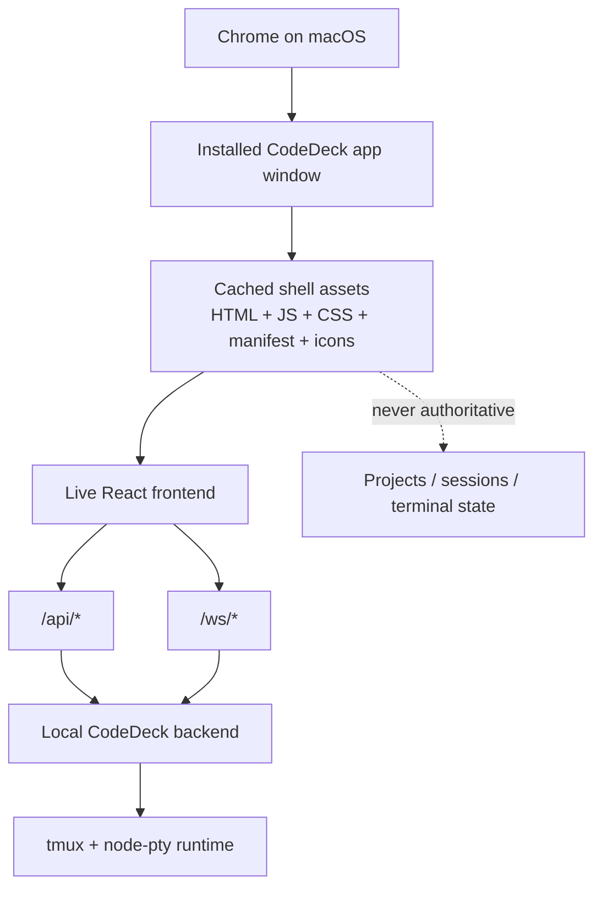
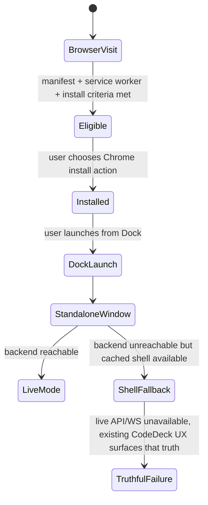
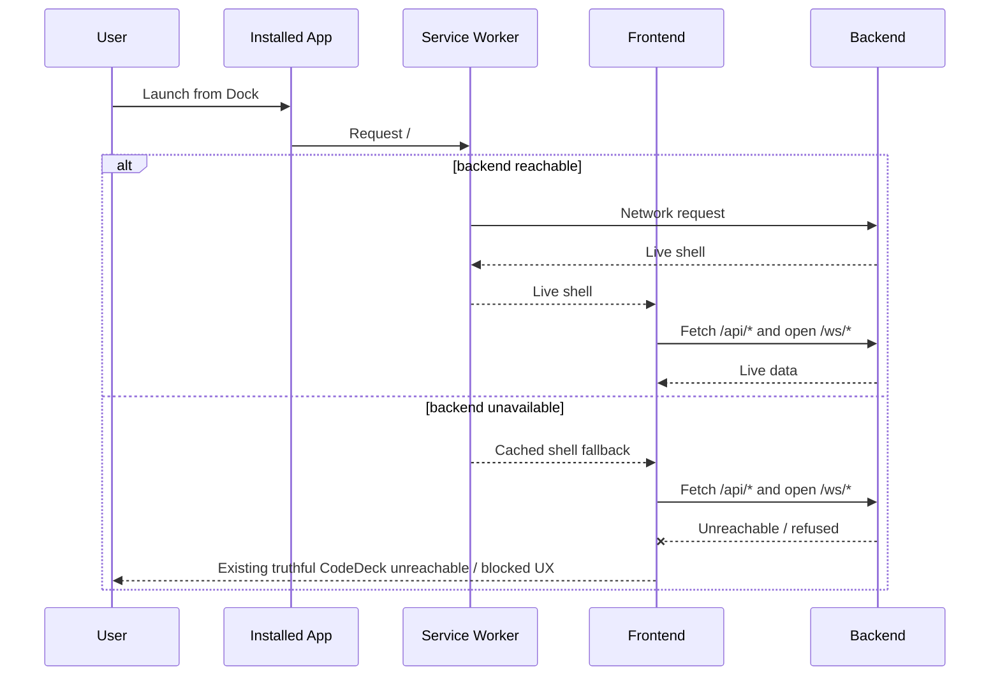

# Installable Chrome PWA Shell — Feature Specification

**Version:** 1.0
**Date:** 2026-04-21
**Status:** Draft

## 1. Overview

CodeDeck currently runs as a normal browser tab. That works, but it does not feel like an app on macOS: there is no Dock install, no standalone app window, and no Chrome-native install experience.

This feature adds an **installable PWA shell** for CodeDeck with a deliberately narrow product contract:

1. CodeDeck can be installed from **Chrome on macOS** using Chrome's native install UI.
2. The installed app opens in a **standalone app window** with proper app metadata and icons.
3. The installed app remains a **thin shell** around the existing live CodeDeck stack.
4. The installed app may cache only enough shell assets to open the UI when the local server is temporarily unavailable.
5. The installed app must **not** pretend CodeDeck works offline — backend state, session state, and terminal truth remain live-only.

This is an installability feature, not a desktop-runtime migration. CodeDeck still depends on the same local backend, WebSocket transport, `tmux`, and `node-pty` runtime contract.

## 2. Architecture and Authority Model

### 2.1 Placement in the existing architecture

### 2.2 Authority boundaries

| Concern | Authority | Notes |
| --- | --- | --- |
| Installability metadata | Manifest + HTML metadata | Browser-controlled install surface |
| Shell asset availability | Service worker cache | Shell only; never live session truth |
| Projects, sessions, runtime health | Live backend `/api/*` responses | Backend remains authoritative |
| Terminal attachment and output | Live `/ws/terminal` + tmux | No offline terminal authority |
| Backend-unavailable messaging | Existing CodeDeck unreachable / blocked UI | Prefer current truthful UX over browser-generic failure when shell is available |

### 2.3 Origin and port contract

The PWA must be **origin-relative**:

- no hardcoded `localhost:43000` in manifest metadata
- no hardcoded frontend port in service-worker cache rules
- no absolute host/port assumptions in installability assets

The installed app is still naturally bound by Chrome to the **origin it was installed from**, including that origin's port. The contract here is: **CodeDeck must not hardcode the port**. Chrome may still bind the installed app to the install origin as normal browser behavior.

## 3. Product Scope and Non-Goals

### 3.1 In scope

- Chrome on macOS only
- Chrome-native install UX only
- Standalone installed app window
- Dock/app icon and app metadata derived from PWA metadata
- Shell-only caching so the installed app can reopen the CodeDeck UI shell after a prior successful load
- Truthful fallback to the existing unreachable/runtime-blocked UI when the backend is unavailable

### 3.2 Explicit non-goals

This feature does **not** include:

- Safari installability
- Electron, Tauri, or any other packaged desktop runtime
- automatic startup of `./server.sh`, `tmux`, or the local backend
- offline terminal sessions
- offline project/session data
- in-app install banners, prompts, or custom install CTAs
- cached API responses acting as authoritative state

### 3.3 Success criteria

The feature is successful when all of the following are true:

- Chrome offers a native install path for CodeDeck on macOS
- the installed app launches from the Dock in a standalone window
- when the backend is running, the installed app behaves like the normal CodeDeck web app
- after a prior successful online load, the installed app can reopen the shell even if the local server is temporarily unavailable
- when the backend is unavailable, CodeDeck fails honestly using its own existing UX rather than presenting stale terminal or session truth as if it were live

## 4. Installability Contract

### 4.1 Web app manifest requirements

CodeDeck must expose a web app manifest with the following contract:

| Field | Requirement | Notes |
| --- | --- | --- |
| `name` | `CodeDeck` | Full app name shown by Chrome |
| `short_name` | `CodeDeck` | Used in tighter UI surfaces |
| `description` | Short description of CodeDeck as a local terminal workspace | Must not imply offline terminal support |
| `start_url` | `/` | Relative root; no hardcoded host or port |
| `scope` | `/` | Entire frontend shell scope |
| `id` | `/` | Stable, relative app identity |
| `display` | `standalone` | Installed app opens without normal browser chrome |
| `theme_color` | Match the CodeDeck dark theme | Used by installed window chrome |
| `background_color` | Match the CodeDeck dark background | Splash/loading consistency |
| `icons` | PNG icon set including install-ready sizes | See §8 |

The manifest must use **relative URLs** only.

### 4.2 HTML metadata requirements

The frontend shell must expose the manifest and app metadata through the main HTML entry point:

- manifest link tag present
- theme color metadata aligned with the manifest
- icon metadata aligned with installed-app assets
- no hardcoded absolute localhost URLs in any PWA metadata

### 4.3 Chrome-native install UX only

CodeDeck must rely on **Chrome's native install affordances**:

- omnibox / app-install affordance
- Chrome menu install entry

CodeDeck must **not** add:

- in-app install banner
- floating install CTA
- modal prompting the user to install the app

### 4.4 Install and launch lifecycle

## 5. Shell Caching Contract

### 5.1 What may be cached

The service worker may cache **shell assets only**:

- navigation shell for `/`
- same-origin built JavaScript bundles
- same-origin built CSS assets
- manifest file
- app icon assets used for installability
- other same-origin static assets required to render the CodeDeck shell

Cross-origin fonts are optional for shell availability. If they are unavailable, CodeDeck may render with normal browser font fallback.

### 5.2 What must never become cached authority

The service worker must **not** cache or replay these as authoritative product state:

- `/api/*` responses
- `/ws/*` traffic
- terminal snapshots, replay chunks, or terminal output buffers
- project lists as offline truth
- session lists as offline truth
- runtime health as offline truth

If live data is unavailable, the installed app must show that unavailability — not cached truth masquerading as current truth.

### 5.3 Required cache strategy

| Request type | Strategy | Reason |
| --- | --- | --- |
| Navigation to `/` | Network-first with cached shell fallback | Prefer live app, but allow shell reopening after prior load |
| Same-origin static shell assets | Cache-first or stale-while-revalidate | Supports fast shell boot and restart resilience |
| `/api/*` | Network-only | Backend remains authoritative |
| `/ws/*` | Live network only | Terminal transport must never be cached |

### 5.4 Backend-unavailable launch flow

### 5.5 No offline promise

The installed app may reopen the **shell**, but it must not market or behave as an offline-capable terminal workspace. Shell availability is a convenience feature, not a change in CodeDeck's live-runtime contract.

## 6. Installed App Runtime Behavior

### 6.1 When the backend is available

When the local CodeDeck stack is running, the installed app must behave the same as the normal web app:

- same frontend routes
- same `/api/*` calls
- same `/ws/*` terminal behavior
- same truthful runtime/session handling

Installability must not introduce a parallel runtime path.

### 6.2 When the backend is unavailable

When the local backend is unavailable and a cached shell exists:

- the installed app may still open the CodeDeck shell
- live fetches and WebSocket attachment attempts may fail naturally
- the UI must surface the failure using existing truthful CodeDeck behavior
- the app must not imply that projects, sessions, or terminals are currently available if they have not been confirmed by the backend

Persisted local UI preferences may still apply, such as:

- sidebar compact state
- file tree width
- non-authoritative local layout metadata

But those must never override live backend truth for:

- project availability
- session availability
- runtime availability
- terminal attachment state

### 6.3 No special PWA-only failure surface required

This feature does **not** require a dedicated PWA-only empty state. The preferred behavior is:

1. load the CodeDeck shell when possible
2. let the live app attempt its normal same-origin fetches and WebSocket connections
3. surface failure through the app's existing unreachable / runtime-blocked UX

A browser-generic network error is acceptable only when no cached shell is available.

## 7. Existing Network Surfaces and No API Changes

### 7.1 No new endpoints

This feature does not add or modify backend API contracts.

| Surface | Purpose | Change |
| --- | --- | --- |
| `GET /api/projects` | Load projects | Unchanged |
| `GET /api/sessions` | Load live session summaries | Unchanged |
| `GET /api/health` | Load runtime availability | Unchanged |
| `GET /api/config` | Load client settings/config | Unchanged |
| `WS /ws/terminal` | Terminal transport | Unchanged |

### 7.2 No database or schema changes

This feature introduces:

- no SQLite schema changes
- no new persisted domain entities
- no REST DTO changes
- no WebSocket message changes

## 8. Asset Requirements

### 8.1 Installability asset set

CodeDeck must provide install-ready icon assets beyond the existing favicon usage.

| Asset type | Requirement | Purpose |
| --- | --- | --- |
| Browser tab favicon | Keep existing browser-compatible favicon behavior | Tab / browser UI |
| App icon 192×192 PNG | Required | Chrome install surfaces |
| App icon 512×512 PNG | Required | Installed app / larger install surfaces |
| Maskable 512×512 PNG | Recommended for v1 | Better installed icon treatment where supported |

### 8.2 Metadata consistency

The icon set, manifest metadata, and HTML metadata must all describe the same app identity:

- app name: `CodeDeck`
- dark-theme colors aligned with the product
- no conflicting icon identities between tab and installed app

## 9. Acceptance Criteria

### 9.1 User-facing acceptance

1. A user running CodeDeck in Chrome on macOS can install the app through Chrome's native install UI.
2. The installed app appears as `CodeDeck` and opens from the Dock.
3. The installed app opens in a standalone window rather than a normal browser tab frame.
4. With the backend running, the installed app behaves like the existing live CodeDeck UI.
5. After at least one prior successful online load, launching the installed app while the backend is down opens the cached shell if available.
6. In that backend-down case, the app surfaces truthful existing failure states rather than stale terminal/session truth.
7. The installed app does not expose any in-app install CTA.
8. No explicit hardcoded localhost port appears in manifest or PWA metadata.

### 9.2 Behavioral invariants

- backend remains authoritative
- shell cache is not authoritative live state
- WebSocket transport is never cached
- installed-app launch must not create an offline terminal illusion

## 10. Testing and Verification Requirements

### 10.1 Automated verification expectations

Implementation is not complete until these are proven:

1. manifest and HTML metadata are present and internally consistent
2. service-worker cache rules distinguish shell assets from live `/api/*` and `/ws/*` traffic
3. no hardcoded fixed-port localhost strings appear in installability metadata or cache rules
4. cached-shell fallback can occur without turning cached API/session data into product truth

### 10.2 Manual acceptance expectations

A human tester must be able to verify all of the following in Chrome on macOS:

- install CodeDeck from Chrome
- launch it from the Dock
- observe a standalone app window
- use CodeDeck normally while the backend is running
- stop the backend and relaunch the installed app
- observe that the app opens only the shell and then truthfully reports live unavailability
- restart the backend and confirm the installed app returns to normal live behavior

### 10.3 Port/origin verification

Verification must confirm that:

- manifest fields are relative rather than fixed to a specific port
- service-worker cache logic is origin-relative
- the feature works for whichever localhost origin is actually serving CodeDeck at install time
