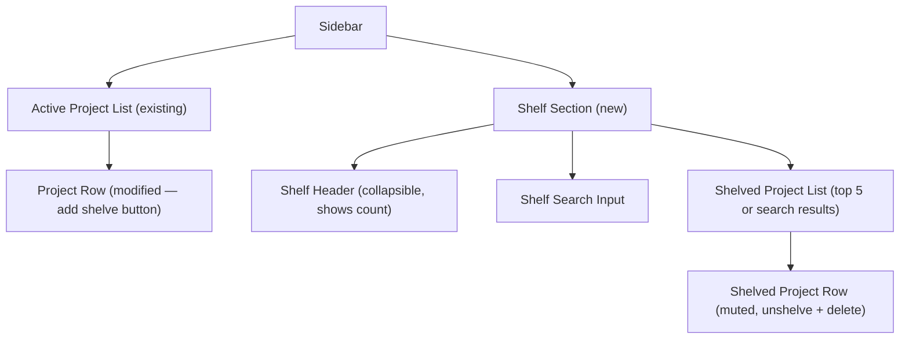

# Project Shelf — Frontend Specification

**Version:** 1.0
**Date:** 2026-04-10
**Status:** Draft
**Backend Spec:** N/A (backend changes are minimal and defined inline in this spec)

## 1. Overview

The project shelf adds visual organization to the sidebar by splitting projects into two sections: **active** (top) and **shelved** (bottom). Shelving is purely cosmetic — it moves a project out of the active working set without affecting terminals or sessions. This keeps the sidebar focused when managing 20-50+ projects.

**UX Goals:**
- Active sidebar shows only the 3-5 projects you're currently working on
- Shelved projects are accessible but out of the way (collapsible, collapsed by default)
- Shelved section handles scale: shows top 5 most recently shelved + search for the rest
- One-click to shelve/unshelve — no modals, no confirmations

## 2. Pages & Routes

No new pages or routes. The shelf lives entirely within the existing sidebar component.

## 3. Component Architecture



### New Components

| Component | Purpose | Location |
|-----------|---------|----------|
| `ShelfSection` | Collapsible container for shelved projects, header, search | Inline in `Sidebar.jsx` (not a separate file — small enough) |
| `ShelfSearch` | Compact search input filtering shelved projects by name | Inline in `Sidebar.jsx` |
| `ShelvedProjectRow` | Muted project row with unshelve + delete actions | Inline in `Sidebar.jsx` |

### Modified Components

| Component | Changes |
|-----------|---------|
| `Sidebar.jsx` | Add shelf section below active projects, add shelve button to active project rows, accept new props (`onShelve`, `onUnshelve`) |
| `App.jsx` | Add `shelveProject()` and `unshelveProject()` handlers, filter projects into active/shelved before passing to Sidebar |

## 4. API Integration Map

| Endpoint | UI Trigger | Request Change | Success Behavior | Error Behavior |
|----------|-----------|----------------|------------------|----------------|
| `PUT /api/projects/:name` | Click shelve button | Send `{ shelved: true, shelvedAt: ISO timestamp }` | Project moves to shelved section, toast "Project shelved" | Error toast |
| `PUT /api/projects/:name` | Click unshelve button or click shelved project row | Send `{ shelved: false, shelvedAt: null }` | Project moves to active section + selected, toast "Project restored" | Error toast |
| `GET /api/projects` | On mount + after mutations | No change to request | Frontend filters response into active (`!shelved`) and shelved (`shelved === true`) | Existing error handling |
| `DELETE /api/projects/:name` | Click delete on shelved row | No change | Project removed, toast "Project removed" | Error toast |

### Backend Data Model Change

The project object shape extends from:
```json
{ "name": "my-app", "path": "/Users/..." }
```

To:
```json
{ "name": "my-app", "path": "/Users/...", "shelved": false, "shelvedAt": null }
```

- `shelved` — boolean, defaults to `false`. Existing projects without this field are treated as active.
- `shelvedAt` — ISO 8601 timestamp or `null`. Set when shelving, cleared when unshelving. Used to sort shelved projects (most recent first).

**Backwards compatibility:** `GET /api/projects` returns projects as-is from SQLite. Frontend treats missing `shelved` field as `false`.

## 5. Sidebar Layout

### 5.1 Overall Structure

```
┌─────────────────────────┐
│ CODEDECK          📁 +  │  ← Header (unchanged)
├─────────────────────────┤
│ ● project-alpha    ⬇ ✎🗑│  ← Active projects (unchanged + shelve button)
│   2 terminals · 14m     │
│                         │
│ ● project-beta     ⬇ ✎🗑│
│   1 terminal · 3m       │
│                         │
│                         │  ← Flex space (active list scrolls)
│                         │
├╌╌╌╌╌╌╌╌╌╌╌╌╌╌╌╌╌╌╌╌╌╌╌┤
│ ▸ Shelved (12)          │  ← Shelf header (collapsed)
├─────────────────────────┤
│ 3 projects · ⚙         │  ← Footer (unchanged)
└─────────────────────────┘
```

When shelf is expanded:

```
┌─────────────────────────┐
│ CODEDECK          📁 +  │
├─────────────────────────┤
│ ● project-alpha    ⬇ ✎🗑│
│   2 terminals · 14m     │
├╌╌╌╌╌╌╌╌╌╌╌╌╌╌╌╌╌╌╌╌╌╌╌┤
│ ▾ Shelved (12)          │  ← Expanded
│ ┌─────────────────────┐ │
│ │ Search shelved...   │ │  ← Search input
│ └─────────────────────┘ │
│   old-project-1    ↑ 🗑 │  ← Shelved rows (muted)
│   old-project-2    ↑ 🗑 │
│   old-project-3    ↑ 🗑 │
│   old-project-4    ↑ 🗑 │
│   old-project-5    ↑ 🗑 │
│   + 7 more              │  ← Overflow hint
├─────────────────────────┤
│ 3 projects · ⚙         │
└─────────────────────────┘
```

### 5.2 Active Project Rows (Modified)

Existing project rows gain a **shelve button** — a small `Archive` icon (from lucide-react) positioned before the rename (`Pencil`) and delete (`Trash2`) buttons.

Button order on hover: `FolderSearch` | `Archive` | `Pencil` | `Trash2`

### 5.3 Shelf Header

- Thin horizontal divider line (`1px solid var(--border)`) above the header
- Text: `▸ Shelved (N)` where N is total shelved count — or `▾ Shelved (N)` when expanded
- Chevron: `ChevronRight` / `ChevronDown` from lucide-react
- Font: `var(--text-muted)`, 11px, uppercase tracking
- Click anywhere on the header row to toggle expand/collapse
- **Collapsed by default** on page load (state in localStorage for persistence)

### 5.4 Shelved Project Rows

- **Muted appearance:** text color `var(--text-muted)`, no status dot, no terminal count, no elapsed time
- **No status cockpit** — shelved projects don't show session info even if sessions exist
- **Actions:** `ArchiveRestore` (unshelve) + `Trash2` (delete) — no rename, no file browse
- **Click row:** Unshelves the project and selects it (same as clicking unshelve button + auto-select)
- **Hover:** Same `var(--bg-hover)` as active rows

### 5.5 Display Limit & Overflow

- Show at most **5 shelved projects** (sorted by `shelvedAt` descending — most recently shelved first)
- If more than 5 shelved: show `+ N more` text below the list in `var(--text-muted)`, 11px
- When search is active: show all matching results (no 5-item limit), hide the `+ N more` text

### 5.6 States

| State | Display |
|-------|---------|
| No shelved projects | Shelf header hidden entirely |
| 1-5 shelved, collapsed | `▸ Shelved (N)` header only |
| 1-5 shelved, expanded | Header + all projects (no search needed) |
| 6+ shelved, collapsed | `▸ Shelved (N)` header only |
| 6+ shelved, expanded | Header + search input + top 5 + "N more" hint |
| Search active, results found | Header + search input + matching projects |
| Search active, no results | Header + search input + "No matches" text |

## 6. Search

### 6.1 Search Input

- Appears only when shelf is expanded AND there are more than 5 shelved projects
- Compact: height 28px, `var(--bg-input)` background, 6px border radius, 12px font
- Placeholder: `"Search shelved..."`
- Icon: `Search` (lucide-react, 12px) inside the input as prefix
- Clears on: Escape key, clicking the X clear button, or collapsing the shelf section

### 6.2 Search Behavior

- **Client-side filter** — all shelved projects are already loaded, filter by `name.toLowerCase().includes(query.toLowerCase())`
- **Instant filtering** — no debounce needed (filtering a local array of <100 items)
- **Results replace the top-5 list** — when search query is non-empty, show all matches sorted alphabetically
- **No results:** Show "No matches" in `var(--text-muted)`, centered

## 7. Shared Components

No new shared components. All shelf UI is contained within `Sidebar.jsx`.

## 8. State Management

### 8.1 App.jsx State

The existing `projects` state already holds all projects. No new state variable needed — just filter:

```javascript
const activeProjects = projects.filter(p => !p.shelved);
const shelvedProjects = projects
  .filter(p => p.shelved)
  .sort((a, b) => new Date(b.shelvedAt) - new Date(a.shelvedAt));
```

### 8.2 New Handlers in App.jsx

```javascript
shelveProject(name)    // PUT /api/projects/:name { shelved: true, shelvedAt: new Date().toISOString() }
unshelveProject(name)  // PUT /api/projects/:name { shelved: false, shelvedAt: null }
```

Both call `fetchProjects()` after success to refresh the list.

### 8.3 Sidebar Local State

```javascript
const [shelfExpanded, setShelfExpanded] = useState(false);  // collapsed by default
const [shelfSearch, setShelfSearch] = useState('');          // search query
```

Persist `shelfExpanded` to localStorage so it remembers across page loads.

## 9. Design Language

### 9.1 Aesthetic Direction

Consistent with existing CodeDeck dark theme. The shelf section should feel like a quiet drawer — present but unobtrusive. Muted colors, smaller text, minimal chrome.

### 9.2 Color System

All existing CSS custom properties — no new colors needed:
- Shelf header text: `var(--text-muted)`
- Shelved project name: `var(--text-muted)`
- Divider line: `var(--border)`
- Search input: `var(--bg-input)` background, `var(--text-primary)` text
- Hover: `var(--bg-hover)`
- "N more" / "No matches": `var(--text-muted)`

### 9.3 Typography

- Shelf header: 11px, uppercase, `letter-spacing: 0.05em`, `var(--text-muted)`
- Shelved project names: same size as active projects but `var(--text-muted)` color
- Search input: 12px
- Overflow hint ("+ N more"): 11px, `var(--text-muted)`

### 9.4 Spacing & Density

- Shelf section has 8px padding top (below divider)
- Shelved rows are slightly more compact than active rows — 6px vertical padding vs 8px
- Search input: 4px margin bottom
- Divider: 12px margin top to separate from active project list

### 9.5 Motion & Micro-interactions

- **Shelve/unshelve:** Project row slides out of one section and into the other with a 200ms ease transition
- **Shelf expand/collapse:** Content slides down/up with 150ms ease
- **Search results:** Instant (no animation — just list swap)

### 9.6 Component Visual Style

- Shelve button (`Archive` icon): same size and style as existing action buttons (14px, appears on hover)
- Unshelve button (`ArchiveRestore` icon): same treatment
- Search input: matches existing input style in SettingsPanel
- Divider: subtle `1px solid var(--border)`, not a thick separator

### 9.7 Iconography

- `Archive` (lucide-react) — shelve action on active project rows
- `ArchiveRestore` (lucide-react) — unshelve action on shelved project rows
- `ChevronRight` / `ChevronDown` (lucide-react) — shelf section expand/collapse
- `Search` (lucide-react) — search input prefix icon
- `X` (lucide-react) — search clear button (12px)

## 10. UX Patterns

### 10.1 Shelving the Active Project

If the user shelves the currently selected (active) project:
1. Project moves to shelved section
2. `activeProject` is cleared (`null`)
3. Terminal area shows the empty/welcome state
4. Toast: "Project shelved"

### 10.2 Unshelving

Two ways to unshelve:
1. Click the `ArchiveRestore` button on a shelved row
2. Click the shelved project row itself

Both do the same thing:
1. Project moves to active section
2. Project is auto-selected (`setActiveProject`)
3. Toast: "Project restored"

### 10.3 Toast Messages

| Action | Toast Type | Message |
|--------|-----------|---------|
| Shelve | Success | "Project shelved" |
| Unshelve | Success | "Project restored" |
| Shelve fails | Error | API error message or "Failed to shelve project" |
| Unshelve fails | Error | API error message or "Failed to restore project" |

### 10.4 Error Handling

All shelve/unshelve operations follow the existing pattern:
```javascript
try {
  const res = await fetch(...)
  if (!res.ok) { /* error toast from response */ }
  else { /* success toast + fetchProjects() */ }
} catch {
  showToast({ type: 'error', message: 'Server unreachable' })
}
```

## 11. Responsive Behavior

N/A — CodeDeck is a desktop-only tool (browser-based terminal workspace). The sidebar is a fixed 220px width. No mobile considerations.

## 12. Accessibility

- Shelf header: `role="button"`, `aria-expanded="true|false"`, keyboard focusable, Enter/Space toggles
- Shelve/unshelve buttons: `aria-label="Shelve project"` / `aria-label="Restore project"`
- Search input: `aria-label="Search shelved projects"`
- Shelved project rows: focusable, Enter to unshelve
- Tab order: active projects → shelf header → (if expanded) search → shelved projects → footer
