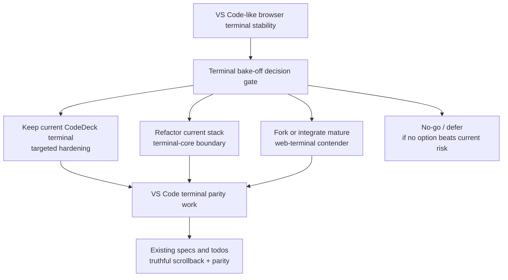
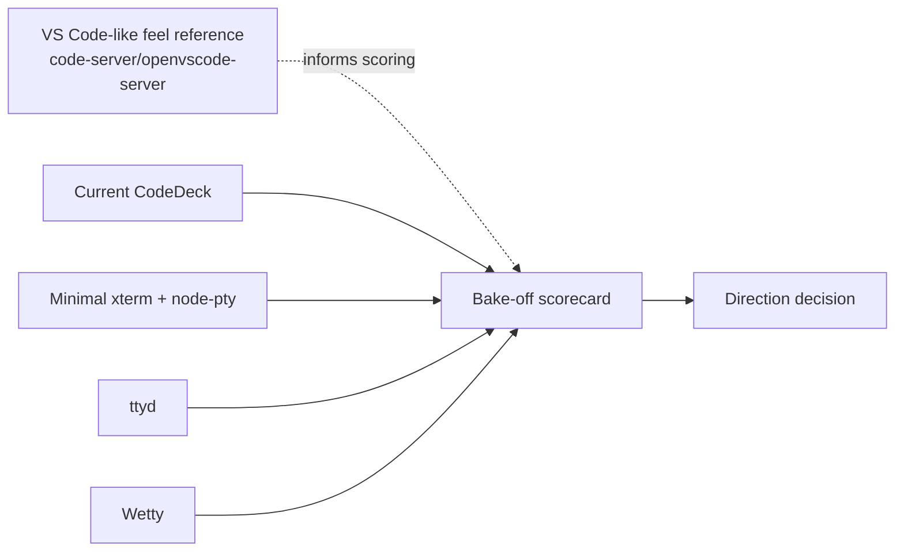
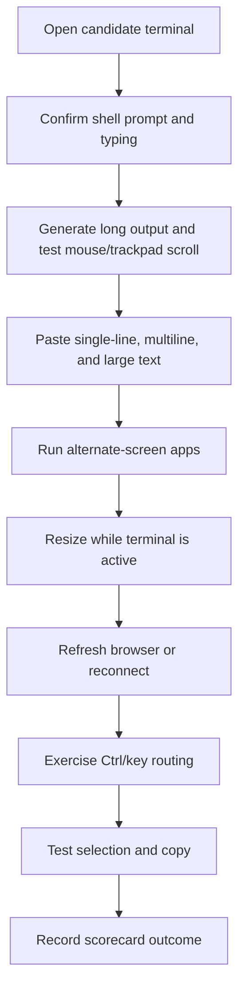
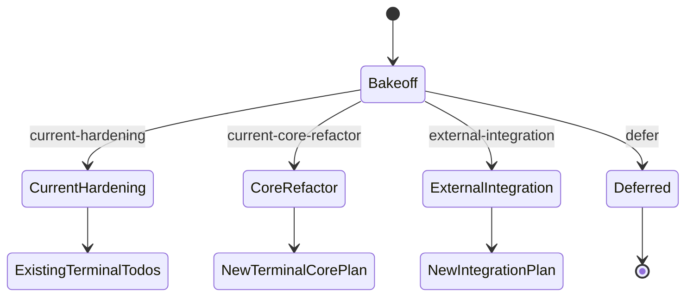

# Terminal Bake-Off Decision Gate — Feature Specification

**Version:** 1.0
**Date:** 2026-04-24
**Status:** Draft

## 1. Overview

CodeDeck needs a browser terminal experience that feels close to the VS Code integrated terminal while preserving CodeDeck's existing multi-project workspace, split-pane workflow, and tmux-backed session durability.

The current terminal is usable, but visible quirks around mouse scrolling, paste behavior, reconnects, resize, and terminal lifecycle recovery create enough uncertainty that the team should not blindly choose between:

- continuing to harden the current implementation
- refactoring the current `xterm.js + node-pty + tmux` stack
- forking or integrating an existing web-terminal project

This feature creates a narrow bake-off decision gate. It does not replace the production terminal. It produces evidence, a scorecard, and a recommendation for the next terminal investment.

## 2. Domain Fit

The bake-off sits before the existing terminal parity and scrollback work. It determines which implementation direction should own that work.

## 3. Candidates

### 3.1 Runnable Candidates

The bake-off must evaluate only candidates that could realistically influence CodeDeck's near-term terminal direction.

| Candidate | Role | Why Included |
| --- | --- | --- |
| Current CodeDeck terminal | Baseline | Measures the actual user experience and prevents theoretical regressions |
| Minimal clean `xterm.js + node-pty` reference | Control | Separates emulator/PTY behavior from CodeDeck-specific lifecycle logic |
| `ttyd` | Mature contender | Strong existing web-terminal project with a focused terminal-over-web scope |
| `Wetty` | Mature contender | Existing xterm/websocket browser terminal with a small product surface |

### 3.2 Reference Benchmark

`code-server` or `openvscode-server` may be used only as a feel/reference benchmark for VS Code-like terminal behavior.

They are not runnable adoption candidates in this bake-off because they bring a full browser IDE surface and may pull CodeDeck toward becoming a wrapper around VS Code rather than a lightweight multi-project terminal workspace.

## 4. Evaluation Dimensions

Each candidate is evaluated against the same terminal torture suite. The scoring must favor observed behavior over architecture claims, popularity, or assumptions.

| Dimension | Success Signal | Failure Signal |
| --- | --- | --- |
| Mouse and trackpad scrolling | Scroll feels stable, predictable, and VS Code-like | Jumps, ignored wheel events, accidental app input, lost position |
| Large output | Long-running output remains responsive and scrollable | Browser stalls, dropped chunks, broken follow behavior |
| Paste behavior | Single-line, multiline, and large paste behave predictably | Partial paste, duplicate paste, unexpected command execution, UI freeze |
| Alternate screen apps | `vim`, `less`, `top`, and similar apps behave correctly | Broken repaint, scroll leakage, bad exit state |
| Resize behavior | Resize preserves usable terminal state | Output jumps, redraw corruption, lost prompt, bad geometry |
| Browser refresh | Refresh restores an understandable terminal state | Blank pane, duplicated history, hidden failure |
| Reconnect | Temporary disconnect recovers without user confusion | Stale view, silent input loss, ambiguous status |
| tmux attach/detach fit | Candidate can coexist with CodeDeck's durability goal | Candidate assumes short-lived raw PTY only |
| Ctrl/key routing | Common shell and browser-conflicting shortcuts are predictable | Browser steals terminal keys or terminal steals app keys |
| Copy/selection | Selection and copy behave as expected for a terminal | Broken selection, accidental scroll jumps, inaccessible copy |
| Integration cost | Can fit CodeDeck without replacing the product | Requires adopting a full IDE or rewriting unrelated product surfaces |

## 5. Scoring Model

Scoring must be simple enough to run quickly and strict enough to avoid wishful conclusions.

Each test receives one of four outcomes:

| Score | Meaning |
| --- | --- |
| `pass` | Behavior is acceptable without material caveats |
| `minor` | Behavior is usable with a documented minor caveat |
| `major` | Behavior is usable only with a significant caveat or workaround |
| `fail` | Behavior is not acceptable for CodeDeck's terminal objective |

Each candidate also receives a short adoption-risk note:

| Risk | Meaning |
| --- | --- |
| `low` | Fits CodeDeck's model with limited changes |
| `medium` | Viable but requires meaningful integration or behavioral tradeoffs |
| `high` | Could solve terminal fidelity but would pull CodeDeck away from its product shape |

The final recommendation must name both the winner and the no-go reasons for the rejected paths.

## 6. Bake-Off Harness Contract

The bake-off harness can be lightweight, but it must be repeatable.

### 6.1 Required Evidence

For each candidate, the bake-off must capture:

- candidate name and version/commit where applicable
- startup command or launch notes
- whether it was tested directly or used as reference only
- per-test outcome
- concise notes for failures and caveats
- screenshots or short recordings for visual/interaction failures when useful
- final adoption-risk note

### 6.2 Required Test Cases

The exact commands may vary by platform, but they should be ordinary shell commands that reproduce real CodeDeck usage rather than synthetic unit tests alone.

## 7. Decision Rules

The bake-off must produce one of these decisions:

| Decision | Meaning |
| --- | --- |
| `current-hardening` | Current CodeDeck terminal is close enough; address known quirks directly |
| `current-core-refactor` | Keep current stack, but refactor lifecycle/transport/viewport ownership before feature work |
| `external-integration` | A mature contender clearly beats CodeDeck and fits the product well enough to integrate |
| `defer` | No contender creates enough confidence to justify a larger terminal project now |

### 7.1 Default Bias

The default bias is to keep CodeDeck's existing stack unless evidence shows that another option materially improves terminal stability without unacceptable product or integration cost.

This bias exists because CodeDeck already has working project context, split panes, tmux durability, file browsing, and terminal diagnostics. A contender must beat the current implementation on actual terminal behavior, not merely look cleaner in isolation.

### 7.2 External Integration Gate

Choosing `external-integration` requires all of the following:

- the contender beats current CodeDeck on the highest-pain tests, especially mouse scrolling, paste, resize, and reconnect
- the contender can reasonably coexist with tmux-backed durability or offers a better equivalent
- the integration does not force CodeDeck to adopt a full IDE product surface
- the unknown risk is lower than continuing to harden the current terminal

### 7.3 Current-Core Refactor Gate

Choosing `current-core-refactor` is appropriate when:

- the minimal `xterm.js + node-pty` control behaves better than current CodeDeck
- the failures appear concentrated in CodeDeck's lifecycle, replay, snapshot, key-routing, or viewport ownership logic
- mature contenders do not clearly justify adoption

## 8. Relationship To Existing Terminal Specs

This feature does not replace these existing documents:

- `docs/specifications/truthful-terminal-scrollback-spec.md`
- `docs/todos/truthful-terminal-scrollback.md`
- `docs/todos/vscode-terminal-parity.md`
- `docs/specifications/terminal-resilience-hardening-spec.md`

Instead, the bake-off decides which implementation direction should continue that work.

## 9. Non-Goals

This feature explicitly does not:

- replace the production CodeDeck terminal
- implement a new terminal runtime
- fork a contender before evidence is collected
- build full VS Code/browser IDE integration
- add new database entities
- introduce user-facing terminal settings
- change the existing terminal WebSocket contract
- resolve every terminal parity issue directly

## 10. Completion Criteria

The bake-off is complete when:

1. all runnable candidates have been evaluated against the same torture suite
2. the VS Code-like reference benchmark has been observed enough to calibrate expected feel
3. a scorecard exists with pass/minor/major/fail outcomes
4. adoption risks are recorded for every candidate
5. the final recommendation names one direction and explains why the alternatives were rejected
6. the next implementation todo is either confirmed as the existing parity plan or explicitly created as a follow-on planning task

