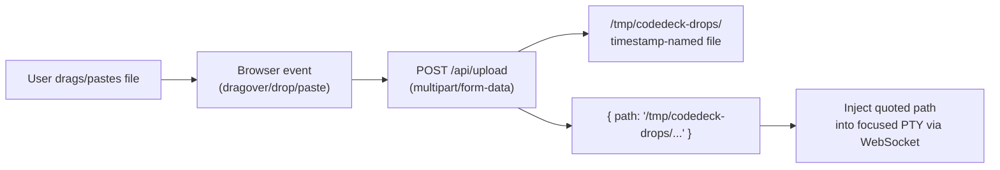

# Terminal File Drop & Paste — Feature Specification

**Version:** 1.0
**Date:** 2026-04-13
**Status:** Draft

## 1. Overview

Agentic CLI tools (Claude Code, Aider, etc.) accept image and file paths as input, but CodeDeck's browser-based terminals don't support drag-and-drop or clipboard paste of files. Dragging a file onto a terminal pane opens it in a new browser tab — the default browser behavior. Pasting a copied file from the filesystem either does nothing or sends raw binary data that the PTY can't use.

This feature bridges the gap: intercept drag-and-drop and clipboard-paste events on terminal panes, upload the file to a temp directory on the backend, and inject the quoted file path into the focused terminal's PTY as if the user typed it.

## 2. Architecture



Both drag-and-drop and clipboard paste follow identical mechanics after the browser event is captured: upload to backend, receive path, inject into PTY.

## 3. Accepted Files

### 3.1 File Types

Any file is accepted. Common use cases:
- **Images**: PNG, JPEG, GIF, WebP, SVG (screenshots for agentic tools)
- **Text-based**: JSON, CSV, TXT, YAML, XML, Markdown
- **Other**: Any file the user intentionally drops or pastes

No allowlist/blocklist filtering — the user decides what to send to their CLI tool.

### 3.2 Size Limit

- Maximum file size: **20MB**
- Files exceeding 20MB are rejected with a `413` status and `{ error: "File too large (max 20MB)" }`
- Frontend shows an error toast when the upload is rejected

## 4. Backend: Upload Endpoint

### 4.1 Endpoint

| Method | Path | Action | Status |
|--------|------|--------|--------|
| POST | `/api/upload` | Save file to temp directory, return path | 201 |

### 4.2 Request

- Content-Type: `multipart/form-data`
- Field name: `file`
- Single file per request

### 4.3 Response

**Success (201):**
```json
{
  "path": "/tmp/codedeck-drops/1713024000000-screenshot.png"
}
```

**Errors:**

| Status | Condition | Response |
|--------|-----------|----------|
| 400 | No file attached | `{ "error": "No file provided" }` |
| 413 | File exceeds 20MB | `{ "error": "File too large (max 20MB)" }` |
| 500 | Write failure | `{ "error": "Failed to save file", "detail": "<message>" }` |

### 4.4 File Storage

- **Directory**: `/tmp/codedeck-drops/`
- **Created on demand**: The directory is created if it doesn't exist when the first upload arrives
- **Naming**: `<timestamp>-<original-filename>` (e.g., `1713024000000-screenshot.png`)
  - Timestamp is `Date.now()` (milliseconds) to avoid collisions
  - Original filename is sanitized: only alphanumeric, hyphens, underscores, and dots allowed; other characters replaced with `_`
- **No cleanup**: The OS handles `/tmp` lifecycle. No server-side purging.

## 5. Frontend: Event Handling

### 5.1 Drag-and-Drop

Events are intercepted on the terminal container (`containerRef` in `Terminal.jsx`):

1. **`dragover`**: Prevent default browser behavior. Show drop zone overlay.
2. **`dragleave`**: Hide drop zone overlay.
3. **`drop`**: Prevent default. Extract file from `event.dataTransfer.files`. Upload to `/api/upload`. On success, inject quoted path into focused PTY.

### 5.2 Clipboard Paste

Intercept the `paste` event on the terminal container:

1. Check `event.clipboardData.files` for file entries
2. If files are present, prevent default, upload to `/api/upload`, inject quoted path
3. If no files (regular text paste), let xterm.js handle it normally

### 5.3 Drop Zone Overlay

A visual indicator appears over the terminal pane during dragover to signal that the terminal accepts file drops:

- Semi-transparent overlay with a subtle border (consistent with existing overlay styles like the reconnect overlay)
- Brief label: "Drop file to paste path"
- Uses existing CSS custom properties (`--accent`, `--bg-base`, etc.)
- Disappears on dragleave or drop

### 5.4 Path Injection

The quoted file path is injected into the **currently focused** terminal pane, regardless of which pane the file was dropped on:

- The path is sent as a WebSocket `input` message: `{ type: 'input', data: '"/tmp/codedeck-drops/..."' }`
- The path is wrapped in double quotes to handle spaces and special characters
- No trailing newline — the user decides when to press Enter

### 5.5 User Feedback

- **Success**: No toast — the path appearing in the terminal is sufficient feedback
- **Error (size limit)**: Error toast: "File too large (max 20MB)"
- **Error (upload failed)**: Error toast: "Failed to upload file"
- **Error (no file)**: No action (shouldn't happen in normal flow)

## 6. Behavioral Rules

1. **Both gestures, same mechanics**: Drag-and-drop and clipboard paste both upload to the backend and inject the path. No difference in behavior.
2. **Focused pane receives input**: The path is always injected into the terminal pane that currently has focus, not the pane the file was dropped on. This is consistent with how keyboard input works.
3. **No trailing newline**: The injected path does not include a newline character. The user presses Enter to submit it to whatever CLI tool is running.
4. **Regular paste passthrough**: When a paste event contains only text (no files), xterm.js handles it normally. The file-paste interception only activates when `clipboardData.files` is non-empty.
5. **Multiple files**: If multiple files are dropped/pasted at once, each is uploaded separately and all paths are injected space-separated (e.g., `"/tmp/.../a.png" "/tmp/.../b.png"`).
6. **Directory drops**: Directories are not supported — only regular files. If a directory is detected, show an error toast: "Directory uploads not supported".
7. **No fallback logic**: If the upload fails, show the error and stop. No retry, no alternative path.
