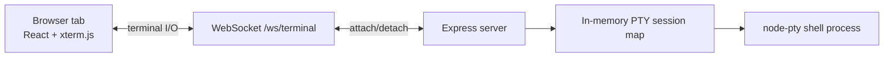
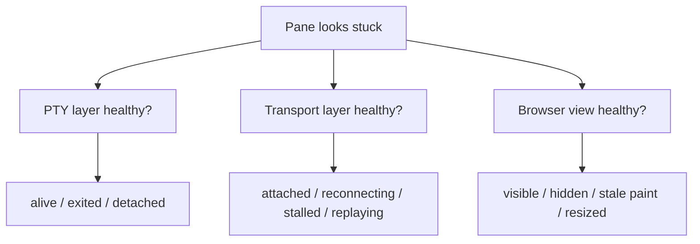
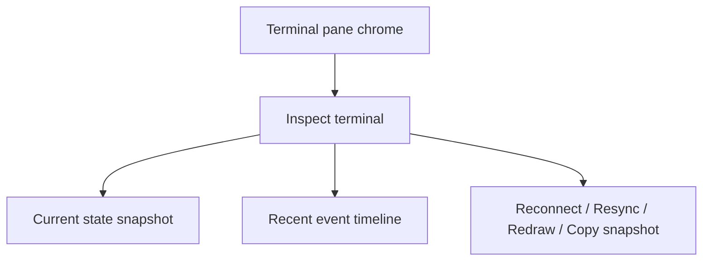
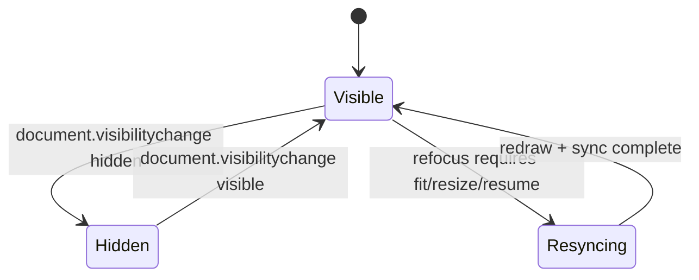
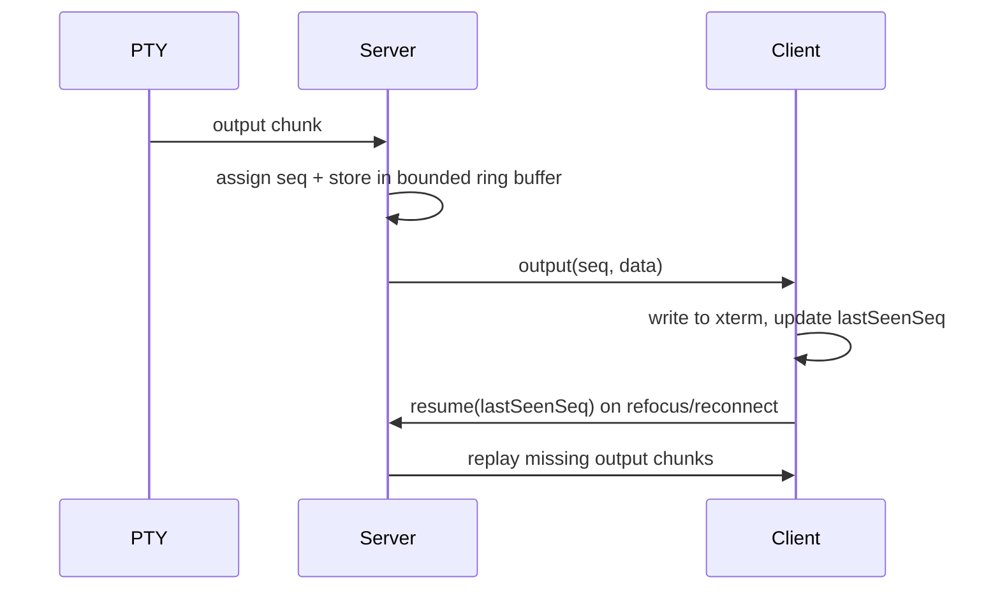
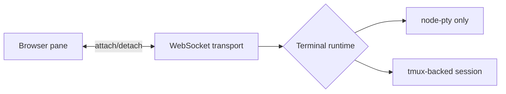
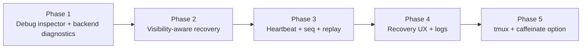

# Terminal Resilience Hardening — Feature Specification

**Version:** 1.0
**Date:** 2026-04-11
**Status:** Implemented

## 1. Overview

CodeDeck already preserves terminal state better than a naive browser terminal: PTY sessions remain alive on the backend when the browser WebSocket disconnects, and the frontend reconnects with exponential backoff. The remaining problem is reliability under stress: when many long-running terminals are open, a pane can appear frozen, repaint only after focus returns, or otherwise become ambiguous about whether the PTY, transport, or browser view is the failing layer.

This feature adds a lock-step hardening program with two goals:

1. Make terminal failures diagnosable at the exact pane that feels wrong.
2. Make terminal attachment and recovery deterministic across backgrounding, reconnects, replay, and eventually a more durable terminal substrate.

The scope explicitly includes both the near-term hardening work inside the current `node-pty + WebSocket + xterm.js` architecture and the larger durable-session path via tmux-backed sessions and optional macOS `caffeinate` support.

## 2. Current Failure Model

### 2.1 Existing Architecture



### 2.2 Observed Reliability Gap

The current system can preserve PTY lifetime while still failing to communicate clear state to the user:

- The PTY may still be alive while the browser view appears frozen.
- The WebSocket may be open but stale or half-dead.
- The browser may be hidden or background-throttled and stop repainting promptly.
- The client may miss output during reconnect or background transitions without any explicit recovery model.

### 2.3 Desired Diagnostic Boundaries



The product must classify failures across those three layers instead of collapsing them into a single connected/disconnected guess.

## 3. UX Surface

### 3.1 Default User Experience

This feature is for debugging and recovery, not for ambient wall-display telemetry. The main product surface stays quiet by default.

- No persistent global observability dashboard is added to the default layout.
- Routine terminal work should look almost unchanged.
- Diagnostic state becomes visible only when a pane is suspected to be unhealthy or when the user explicitly asks to inspect it.

### 3.2 Pane-Local Debug Inspector

Every terminal pane gets a small debug entry point in its chrome, such as a bug icon or `Inspect` action.

Opening the inspector reveals:

- a current health snapshot
- a recent timeline of lifecycle events
- explicit recovery actions
- a `Copy debug snapshot` affordance

### 3.3 Inspector Layout



### 3.4 Health Labels

The computed pane health must use explicit states rather than vague connection wording:

| Health | Meaning |
| --- | --- |
| `healthy` | PTY alive, transport attached, client view current |
| `detached` | PTY alive, no active browser attachment |
| `reconnecting` | reconnect flow is active but not yet restored |
| `stalled` | backend output suggests the pane should be changing but the client view is stale |
| `replaying` | missed output is being replayed to catch the client up |
| `dead` | PTY has exited and cannot be resumed |

## 4. Session Diagnostics Model

### 4.1 Backend Diagnostics Fields

Each session entry extends beyond the existing metadata to support diagnosis and replay.

| Field | Type | Constraints | Default |
| --- | --- | --- | --- |
| `sessionId` | string | existing unique session key | required |
| `cwd` | string | existing session working directory | required |
| `startedAt` | ISO timestamp | existing PTY start timestamp | required |
| `lastOutputAt` | ISO timestamp | updated on every PTY output chunk | required |
| `lastOutputLine` | string | existing preview, max 200 chars | `''` |
| `alive` | boolean | true until PTY exit | `true` |
| `wsAttached` | boolean | true when an active WebSocket is attached | `false` |
| `lastAttachAt` | ISO timestamp nullable | updated on successful attachment | `null` |
| `lastDetachAt` | ISO timestamp nullable | updated on socket close or detach | `null` |
| `lastClientAckAt` | ISO timestamp nullable | updated when client heartbeat or resume ack arrives | `null` |
| `lastReplayAt` | ISO timestamp nullable | updated when replay is served | `null` |
| `lastSeq` | integer | monotonic output sequence number | `0` |
| `replayBufferSize` | integer | bounded output ring buffer size | implementation-defined |
| `stallReason` | enum nullable | computed diagnostic reason | `null` |

### 4.2 Client Diagnostics Fields

The frontend tracks additional non-authoritative state per visible or inspected pane:

| Field | Type | Constraints | Default |
| --- | --- | --- | --- |
| `connectionStatus` | enum | `connecting`, `connected`, `disconnected`, `failed` | `connecting` |
| `documentVisibility` | enum | `visible` or `hidden` | current browser state |
| `lastMessageAt` | ISO timestamp nullable | updated on any terminal message from server | `null` |
| `lastPaintAt` | ISO timestamp nullable | updated when output is written into xterm | `null` |
| `lastResizeAt` | ISO timestamp nullable | updated on refit/resize sync | `null` |
| `lastSeenSeq` | integer | last output sequence acknowledged by client | `0` |
| `reconnectCount` | integer | increments on reconnect attempts | `0` |

### 4.3 Diagnostic Event Timeline

Each session maintains a small bounded event history suitable for debugging:

- attach
- detach
- socket close
- reconnect scheduled
- reconnect opened
- visibility hidden
- visibility visible
- replay requested
- replay served
- forced redraw
- PTY exited
- stall detected

The timeline is short-lived and in-memory only. It is for live debugging, not long-term analytics.

## 5. API Surface

### 5.1 Existing Endpoint Extension

`GET /api/sessions` remains the lightweight session overview endpoint, but it now includes additional health summary fields useful to the sidebar and terminal chrome.

| Method | Path | Action | Status |
| --- | --- | --- | --- |
| `GET` | `/api/sessions` | Return current session summaries with health metadata | Modified |

### 5.2 New Debug Endpoint

The richer diagnostics surface is exposed behind a dedicated debug endpoint.

| Method | Path | Action | Status |
| --- | --- | --- | --- |
| `GET` | `/api/debug/terminal-health` | Return per-session health details and recent event timeline | New |

### 5.3 WebSocket Message Extensions

The terminal protocol grows beyond raw output and resize messages.

| Direction | Type | Purpose |
| --- | --- | --- |
| server → client | `session` | existing session metadata, extended with debug flags as needed |
| server → client | `output` | terminal output chunk with `seq` |
| client → server | `resize` | existing terminal resize |
| client → server | `heartbeat` | client liveness ack |
| server → client | `heartbeat` | server liveness pong |
| client → server | `resume` | request replay from `lastSeenSeq` |
| server → client | `replay` | replayed buffered output chunk(s) |
| server → client | `health` | optional explicit status transition for stall/replay/recovery |

## 6. Request and Response Schemas

### 6.1 `GET /api/sessions`

```json
[
  {
    "sessionId": "anvil-1",
    "cwd": "/Users/sabside/git/anvil/backend",
    "startedAt": "2026-04-11T09:30:00.000Z",
    "lastOutputAt": "2026-04-11T09:44:12.000Z",
    "lastOutputLine": "Working (1m 48s • esc to interrupt)",
    "alive": true,
    "wsAttached": true,
    "lastAttachAt": "2026-04-11T09:31:05.000Z",
    "lastClientAckAt": "2026-04-11T09:44:13.000Z",
    "lastSeq": 812,
    "health": "healthy",
    "stallReason": null
  }
]
```

### 6.2 `GET /api/debug/terminal-health`

```json
{
  "generatedAt": "2026-04-11T09:44:15.000Z",
  "sessions": [
    {
      "sessionId": "anvil-1",
      "health": "stalled",
      "ptyAlive": true,
      "wsAttached": true,
      "documentVisibility": "hidden",
      "lastOutputAt": "2026-04-11T09:44:12.000Z",
      "lastClientAckAt": "2026-04-11T09:43:02.000Z",
      "lastReplayAt": null,
      "lastSeq": 812,
      "lastSeenSeq": 777,
      "reconnectCount": 2,
      "stallReason": "server_output_outpaced_client_ack",
      "events": [
        { "type": "visibility_hidden", "at": "2026-04-11T09:42:20.000Z" },
        { "type": "stall_detected", "at": "2026-04-11T09:44:14.000Z" }
      ]
    }
  ]
}
```

### 6.3 `resume` Message

```json
{
  "type": "resume",
  "sessionId": "anvil-1",
  "lastSeenSeq": 777
}
```

### 6.4 `output` Message

```json
{
  "type": "output",
  "seq": 812,
  "data": "\u001b[32mWorking...\u001b[0m\r\n"
}
```

## 7. Behavioral Rules

### 7.1 Inspector Visibility

- The debug inspector is hidden by default.
- It opens only from a pane-local control.
- The inspector never blocks normal terminal interaction when closed.

### 7.2 Visibility Handling



Rules:

- When the tab becomes hidden, the client records hidden state and continues lightweight liveness handling.
- When the tab becomes visible, the client must refit xterm, resend terminal dimensions, and request resume from the last seen sequence number.
- A visibility transition is not itself a failure; it is a state change that may require resync.

### 7.3 Stall Detection

A session is classified as `stalled` when:

- the PTY is still alive
- recent server output exists
- the client attachment appears open or recently attached
- the client has not acknowledged or painted fresh output within the stall threshold

Stall classification must be explicit and recoverable, not inferred only from user complaint.

### 7.4 Replay Buffering



Rules:

- Every output chunk receives a monotonic sequence number.
- The backend stores a bounded ring buffer of recent output chunks per session.
- On reconnect or refocus, the client requests replay from its last seen sequence number.
- If replay cannot fully satisfy the gap, the session remains recoverable but the inspector must show that the replay window was exceeded.

### 7.5 Recovery Actions

The inspector provides explicit recovery actions:

- `Reconnect`: drop and re-establish the socket attachment.
- `Resync`: request resume/replay without full teardown.
- `Redraw`: force xterm repaint and resize sync.
- `Copy debug snapshot`: copy the current diagnostic state and recent events.

These actions are for debugging and recovery; they do not mutate PTY history beyond the minimal redraw or reconnect side effects required.

### 7.6 Sidebar and Main UI Interaction

- The main sidebar remains an ambient activity surface, not a debugging console.
- Session health from this feature may inform subtle pane chrome status, but the detailed metrics remain inspector-only.
- No always-on wall of diagnostic counters is added to the main workspace layout.

### 7.7 Durable Session Substrate



Rules:

- tmux-backed sessions are part of the supported roadmap and may be introduced behind a configuration flag.
- The initial implementation stays compatible with the current `node-pty` model.
- tmux mode must preserve the same pane/session concepts from the browser’s perspective.

### 7.8 macOS Sleep Guardrails

- Backend `caffeinate` support is optional and acts as an operational guardrail, not the primary reliability mechanism.
- `caffeinate` must not be required for correctness.
- If enabled, it should be managed via the existing server startup workflow rather than requiring manual shell wrapping.

## 8. Lock-Step Implementation Strategy

### 8.1 Phase Structure

This feature is intentionally delivered in lock-step slices. Each phase must close before the next begins.



### 8.2 Phase Goals

| Phase | Goal |
| --- | --- |
| 1 | Make a sick terminal explain itself |
| 2 | Make background/refocus behavior deterministic |
| 3 | Make transport recovery loss-aware and replayable |
| 4 | Make recovery actions explicit and usable |
| 5 | Make terminal state durable beyond browser lifecycle |

### 8.3 Stop Conditions

- Phase 1 is complete only when a suspected broken pane can be inspected and classified.
- Phase 2 is complete only when refocus triggers deterministic resync behavior.
- Phase 3 is complete only when reconnect/refocus recovery can replay missed output from a bounded buffer.
- Phase 4 is complete only when explicit user recovery actions and supporting logs exist.
- Phase 5 is complete only when tmux-backed sessions and optional `caffeinate` integration are verified behind a safe rollout mechanism.

## 9. Non-Goals

- Building a permanent global metrics dashboard for passive monitoring
- Shipping external telemetry infrastructure such as Prometheus or Grafana in this feature
- Replacing the existing sidebar activity list with a diagnostics console
- Treating `caffeinate` as the sole or primary fix for browser-induced instability

