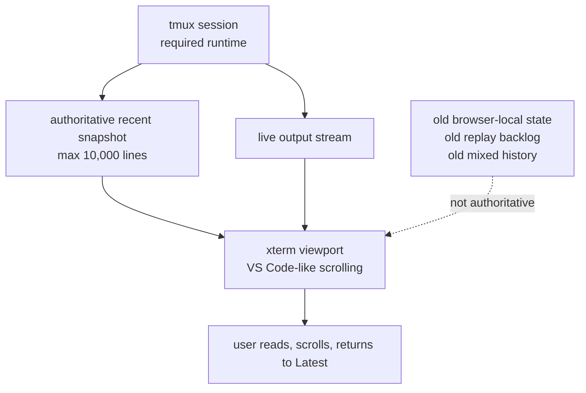
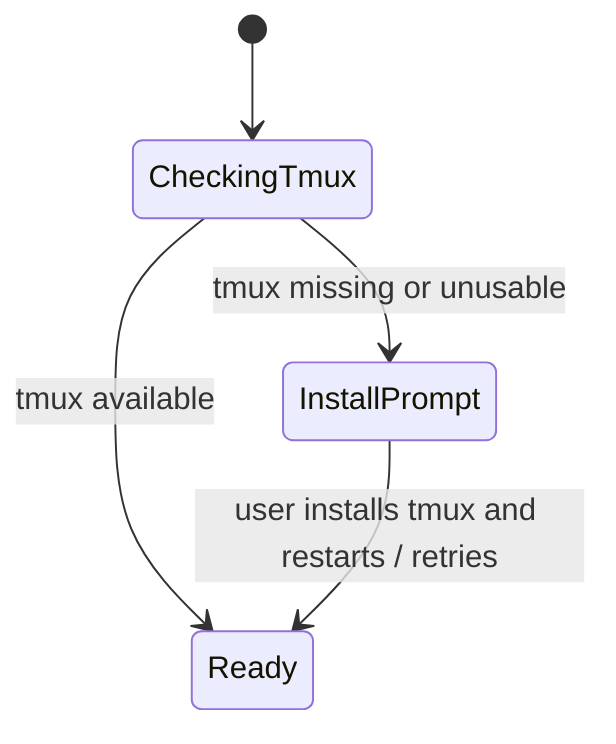
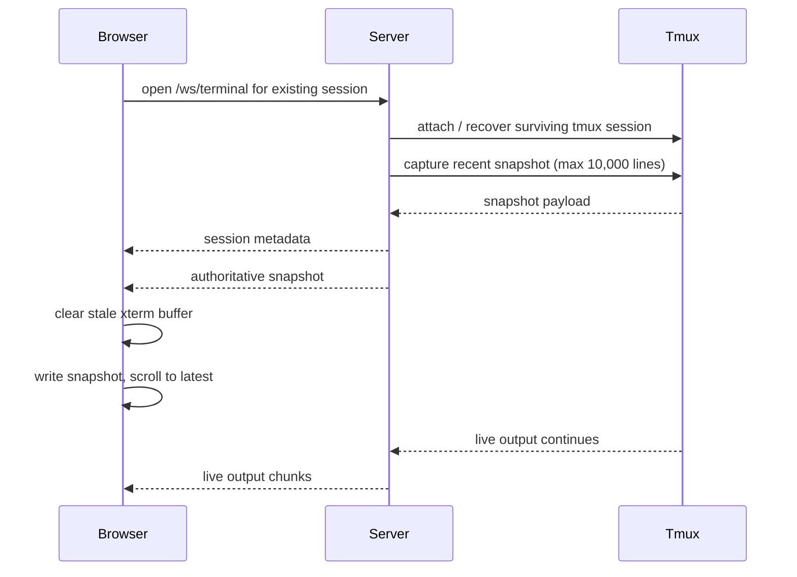

# Truthful Terminal Scrollback — VS Code Semantics

**Version:** 1.0
**Date:** 2026-04-21
**Status:** Draft

## 1. Overview

CodeDeck terminals must behave like the VS Code integrated terminal while preserving the durability guarantees already achieved through tmux-backed sessions.

The primary requirement is **truthfulness**:

- if output is visible in the terminal, it must have really happened
- if output happened within the preserved recent window, it must be available in scrollback
- the terminal must never fabricate, reorder, silently drop, or duplicate visible history during normal use or reconnect

The current hybrid model mixes multiple history authorities:

- tmux scrollback
- browser-local xterm scrollback
- reconnect replay buffers
- special-case history hydration

That hybrid model has produced a failure mode that is unacceptable for high-stakes terminal work: the user can scroll and see content that does not match the real session, or fail to see content that does exist.

This feature resets the contract:

1. **VS Code-style scrolling is the UX target**.
2. **tmux remains the durability substrate**.
3. **A fresh tmux snapshot is the only authoritative reconnect seed**.
4. **The preserved recent history window is fixed at 10,000 lines**.
5. **If CodeDeck cannot guarantee preserved history after reconnect, it must fail visibly rather than bluff**.

## 2. Product Contract

### 2.1 User-facing goals

CodeDeck terminals must provide all of the following at once:

- running terminal sessions survive browser close, browser refresh, and backend restarts
- recent scrollback survives reconnect too
- scrolling with mouse or trackpad feels like VS Code
- when the user is at the bottom, the terminal auto-follows live output
- when the user scrolls up, auto-follow turns off until they explicitly return to bottom
- the `Latest` affordance returns the viewport to the live bottom and re-enables auto-follow

### 2.2 Non-goals

This feature explicitly does **not** require:

- restoration of the exact pre-refresh scroll position
- transparent access to history older than the preserved 10,000-line window
- tmux copy-mode semantics in the normal terminal UX
- raw PTY fallback when tmux is missing
- user-configurable scrollback limits

### 2.3 Success criteria

The feature is successful when all of the following are true:

- a user can close the browser, return later, reconnect to the same tmux session, and scroll through a truthful recent history window
- a user can scroll up while live output continues and trust that the visible history corresponds to real session output
- a hard refresh may reopen at the live bottom, but it must not lose the preserved 10,000-line recent window
- reconnect logic rebuilds the terminal from one authoritative source instead of stitching together conflicting sources

## 3. Architecture and Authority Model

### 3.1 Authority boundaries

| Concern | Authority | Notes |
| --- | --- | --- |
| Live terminal process | tmux session | Required runtime; survives browser and backend lifecycle events |
| Preserved recent history on attach/reconnect | fresh tmux snapshot | Max 10,000 lines; authoritative reconnect seed |
| Current viewport while attached | xterm.js | User-facing scroll UX, seeded from tmux snapshot |
| Live incremental output after attach | tmux-backed PTY stream | Appends after snapshot hydration |
| Reconnect truthfulness | tmux snapshot + explicit warning rules | Replay buffers are not allowed to impersonate preserved history |

### 3.2 Target model



### 3.3 Core rules

1. Every browser attachment starts from a **fresh authoritative tmux snapshot** of the recent window.
2. The browser must **discard old local terminal history** before hydrating that snapshot.
3. The browser must then continue with **live output only**.
4. The reconnect path must not compose visible history from:
   - stale xterm buffer state
   - separate tmux-history backfill messages
   - replay buffers pretending to be durable history
5. If replay buffers remain in the codebase, they are **transport-only** and cannot be the source of preserved history after reattach.

## 4. Runtime Requirement

### 4.1 tmux is mandatory

CodeDeck terminal durability now depends on tmux as a hard requirement.



### 4.2 Missing tmux behavior

If tmux is missing or unusable:

- CodeDeck must not silently fall back to raw PTY mode
- terminal creation and attachment must fail visibly
- the UI must ask the user to install tmux
- the app must be explicit that terminal durability is unavailable until tmux is installed

### 4.3 Health and status surface

The server health/session surfaces must make the runtime contract visible enough for the UI to render correct affordances:

- runtime type must report `tmux`
- tmux availability/unavailability must be explicit
- terminal creation must be blocked when tmux is unavailable

## 5. Scrollback Model

### 5.1 Preserved window

The preserved recent history window is fixed at **10,000 terminal lines**.

Rules:

- this limit is product-owned, not user-configurable
- scrolling stops silently at the top of that window
- there is no transparent fetch of older tmux history beyond that window
- wrapped terminal content counts the same way normal terminal scrollback does; this is a terminal scrollback window, not a semantic log-record system

### 5.2 Attach and reconnect behavior

On every browser attach or reattach, including after refresh, browser close, or backend restart recovery:

1. attach to the surviving tmux session
2. fetch a fresh recent snapshot from tmux, capped at 10,000 lines
3. clear any stale browser-local terminal view
4. hydrate xterm from that fresh snapshot
5. land at the live bottom by default
6. continue with live output

Exact pre-disconnect scroll position restoration is not required.

### 5.3 Attach/reconnect sequence



### 5.4 Live scrolling semantics

The user-facing scrolling behavior must match a normal terminal emulator such as VS Code:

- while pinned to bottom, live output auto-scrolls
- the moment the user scrolls upward, auto-scroll turns off
- while detached, the viewport stays exactly where the user left it
- new output accumulates below the detached viewport
- the existing `Latest` affordance returns to the live bottom and re-enables auto-follow

### 5.5 No tmux-history UX leakage

The normal terminal UX must not expose tmux copy-mode semantics.

That means:

- no user-facing tmux copy-mode workflow for ordinary scrolling
- no wheel routing into tmux history as the primary scroll UX
- no mixed local/tmux scroll handoff that changes the meaning of scrolling mid-session

tmux remains an implementation detail for durability, not a user-facing scrolling mode.

## 6. Truthfulness Rules

### 6.1 Truthfulness guarantee

Within the preserved 10,000-line recent window, CodeDeck must guarantee all of the following:

- no phantom visible lines
- no missing visible lines
- no duplicate visible segments caused by reconnect reconstruction
- no reordering introduced by snapshot/replay merging
- no browser-local history surviving reconnect when it conflicts with the authoritative tmux snapshot

### 6.2 Visible failure rule

If CodeDeck cannot guarantee preserved history after reconnect, it must fail visibly.

Examples include:

- tmux snapshot capture fails
- the session survives but recent history cannot be reconstructed reliably
- the server cannot determine whether the recent window is complete

In those cases CodeDeck must:

- reconnect the live terminal if possible
- show an explicit warning that preserved recent history is unavailable or incomplete
- never silently present best-effort history as if it were guaranteed

### 6.3 Allowed loss boundary

The product is allowed to omit history **older than the top of the preserved 10,000-line window**.

That omission is not treated as an error because it is part of the explicit product contract.

The product is **not** allowed to omit or invent content **inside** the preserved recent window without warning.

## 7. API and WebSocket Contract

### 7.1 REST surface

| Method | Path | Action | Status |
| --- | --- | --- | --- |
| GET | `/api/health` | Report overall app health plus tmux runtime availability | Modified |
| GET | `/api/sessions` | Report terminal session summaries plus history-guarantee metadata | Modified |
| GET | `/api/debug/terminal-health` | Report rich diagnostics including snapshot guarantee state | Modified |

### 7.2 WebSocket message model

The terminal WebSocket protocol must support an authoritative snapshot-based attach path.

| Direction | Type | Purpose |
| --- | --- | --- |
| server → client | `session` | Session metadata including runtime and snapshot contract |
| server → client | `snapshot` | Fresh authoritative recent tmux snapshot, max 10,000 lines |
| server → client | `output` | Live output after snapshot hydration |
| server → client | `history_warning` | Explicit warning that preserved recent history is incomplete or unavailable |
| client → server | `resize` | Resize the attached terminal |

The following message types are out of scope for the user-facing preserved-history path:

- `scroll_history` must not drive ordinary user scrolling semantics
- `resume`/`replay` may remain only as a transport optimization if they are not required for correctness and do not become visible history authority

### 7.3 `session` example

```json
{
  "type": "session",
  "sessionId": "sentinel-7",
  "existing": true,
  "runtimeType": "tmux",
  "snapshotWindowLines": 10000,
  "historyGuaranteed": true
}
```

### 7.4 `snapshot` example

```json
{
  "type": "snapshot",
  "sessionId": "sentinel-7",
  "windowLines": 10000,
  "lineCount": 8421,
  "historyGuaranteed": true,
  "data": "...terminal snapshot payload..."
}
```

### 7.5 `history_warning` example

```json
{
  "type": "history_warning",
  "sessionId": "sentinel-7",
  "reason": "snapshot_unavailable",
  "message": "Recent scrollback could not be restored accurately. Live terminal output is attached, but preserved history is unavailable."
}
```

## 8. Behavioral Rules

### 8.1 Browser close and reopen

If the browser is closed while terminals continue running in tmux:

- the sessions must remain alive
- reconnecting later must reattach to those same running sessions
- the preserved recent 10,000-line window must be restored from tmux when available
- CodeDeck may reopen at the latest/live bottom

### 8.2 Hard refresh

A hard refresh is allowed to reopen at the live bottom.

The critical requirement is not scroll-position fidelity; it is that the recent scrollback window remains truthful and available after reattach.

### 8.3 Backend restart

If the backend restarts while tmux sessions survive:

- CodeDeck must rediscover and reattach to those durable sessions
- reconnect must still use a fresh tmux snapshot rather than relying on stale browser-local history

### 8.4 Top boundary behavior

When the user reaches the top of the preserved recent window:

- scrolling stops silently
- no older history is fetched automatically
- no boundary banner is required

### 8.5 Latest button

The current `Latest` affordance remains part of the product contract:

- visible when the user is detached from the bottom
- returns the terminal to the live bottom
- re-enables auto-follow

## 9. Testing and Verification Requirements

### 9.1 Core invariants

Implementation is not complete until these invariants are proven:

1. reconnect after browser refresh rebuilds from a fresh tmux snapshot
2. reconnect after browser close rebuilds from a fresh tmux snapshot
3. reconnect after backend restart rebuilds from a fresh tmux snapshot
4. scrolling upward detaches auto-follow without corrupting visible history
5. returning to `Latest` resumes live output correctly
6. history older than 10,000 lines is unavailable by design, but content within the recent window is truthful
7. snapshot failure produces a visible warning instead of silent bluffing
8. tmux-missing environments prompt install instead of silently falling back to PTY

### 9.2 Manual acceptance expectations

A human tester must be able to perform all of the following confidently:

- run a long-lived terminal session
- close the browser and return later
- scroll through recent history and confirm it matches the real session
- refresh the browser and still recover recent history
- observe that the terminal behaves like VS Code while attached
- observe that snapshot failure is explicit and visible

## 10. Non-goal Clarifications

This feature does **not** attempt to make CodeDeck a thin tmux copy-mode client.

It also does **not** attempt to preserve arbitrary historical depth beyond the recent window.

The intended end state is narrower and simpler:

- **VS Code semantics in the browser**
- **tmux durability under the hood**
- **one authoritative reconnect seed**
- **truthful recent scrollback or an explicit warning**
